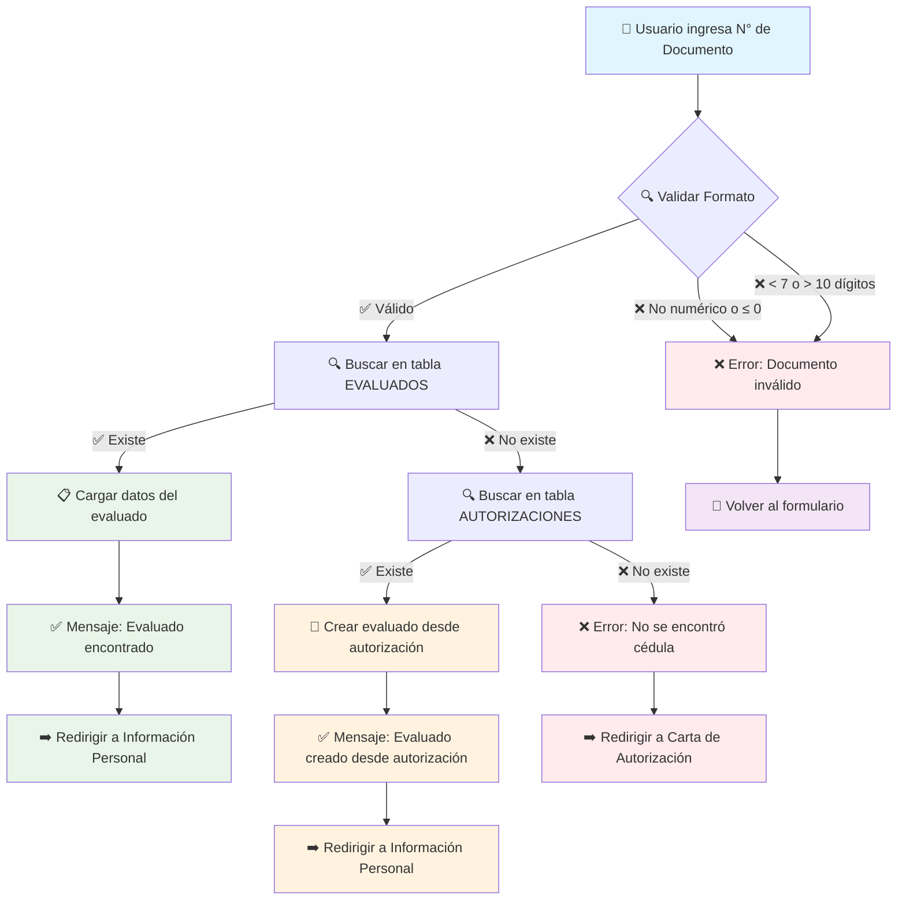
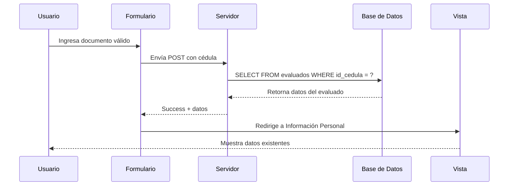
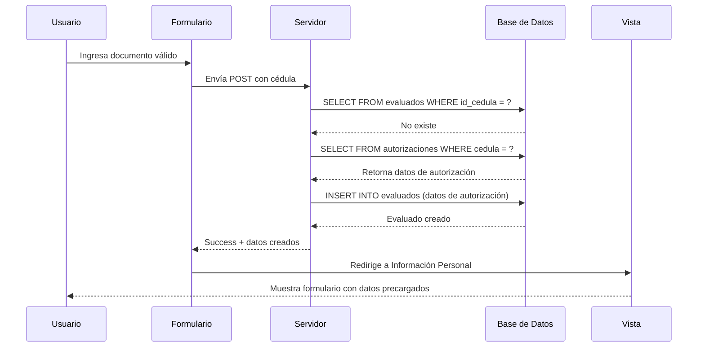
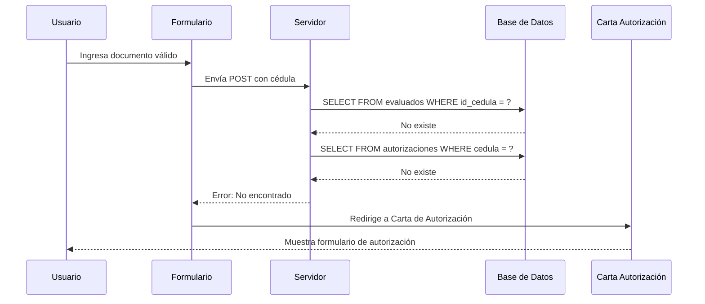
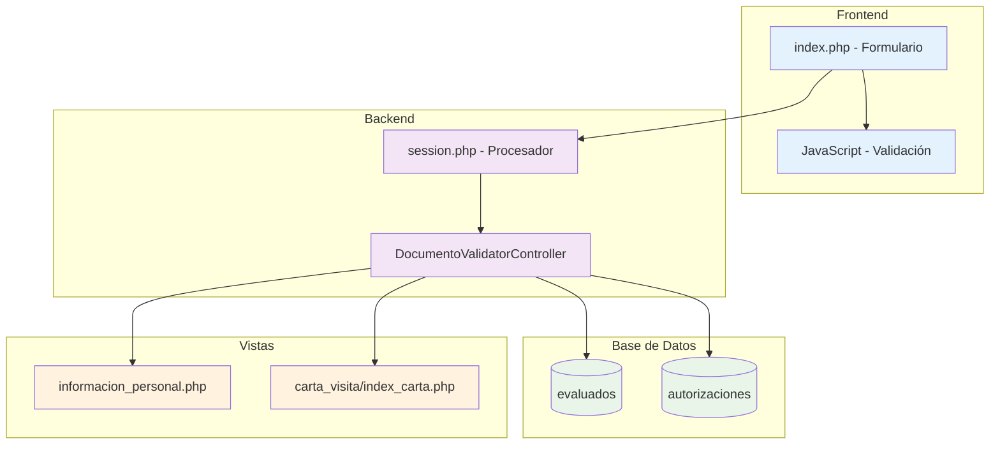
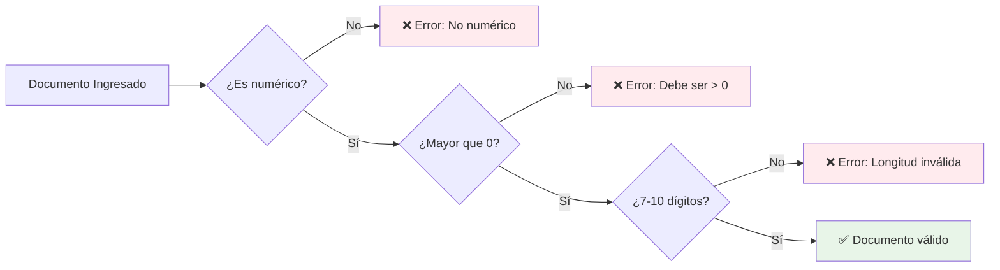

# 🔄 Diagrama del Flujo de Validación de Documentos

## Flujo Optimizado Implementado



## Casos de Uso Detallados

### ✅ Caso 1: Evaluado Existente


### ✅ Caso 2: Crear desde Autorización


### ❌ Caso 3: No Encontrado


## Arquitectura del Sistema



## Validaciones Implementadas



## Mensajes del Sistema

```mermaid
graph TD
    A[Resultado de Validación] --> B{¿Éxito?}
    
    B -->|Sí| C{¿Acción?}
    C -->|evaluado_existente| D[✅ Evaluado encontrado. Redirigiendo...]
    C -->|evaluado_creado| E[✅ Evaluado creado desde autorización. Continúe...]
    
    B -->|No| F{¿Acción?}
    F -->|error| G[❌ Número de documento inválido. Ingrese una cédula válida (7-10 dígitos).]
    F -->|no_encontrado| H[❌ No se encontró ninguna cédula asociada con carta de autorización.]
    
    D --> I[➡️ Información Personal]
    E --> I
    G --> J[🔄 Volver al formulario]
    H --> K[➡️ Carta de Autorización]
    
    style D fill:#e8f5e8
    style E fill:#fff3e0
    style G fill:#ffebee
    style H fill:#ffebee
    style I fill:#e3f2fd
    style J fill:#f3e5f5
    style K fill:#f3e5f5
```
