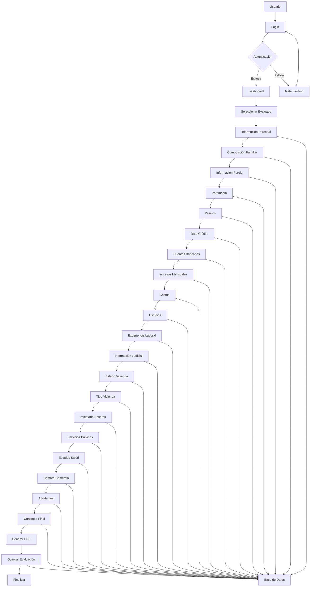
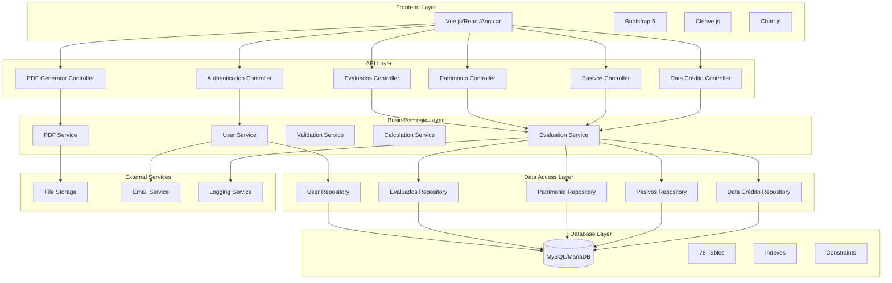
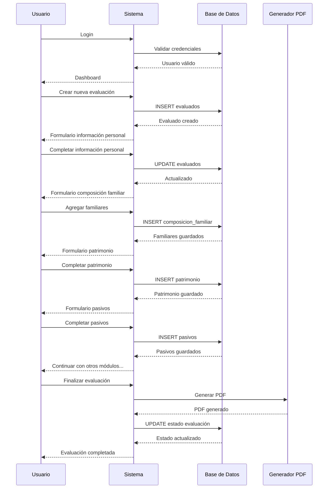
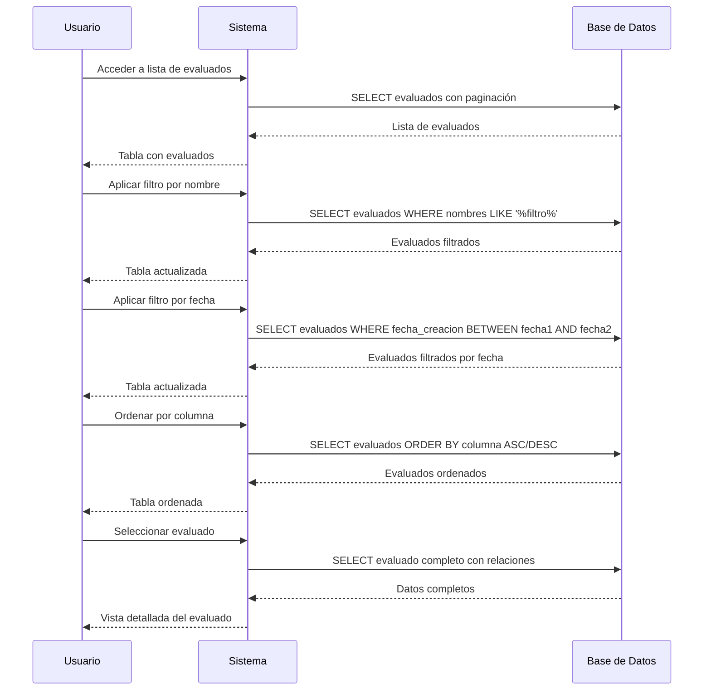
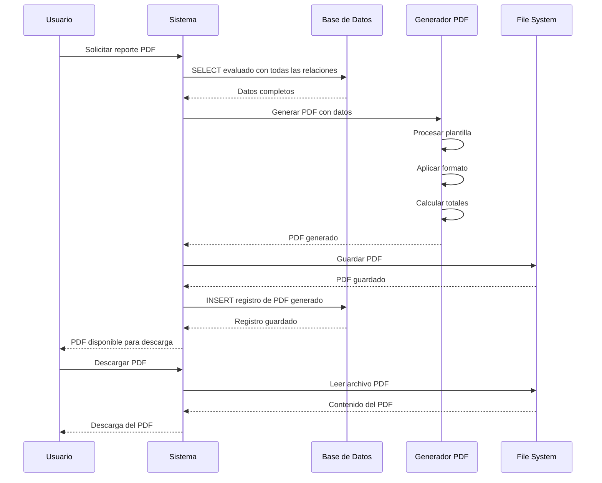
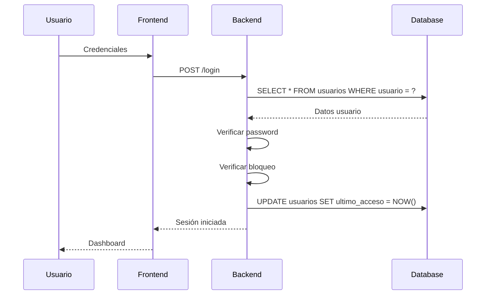
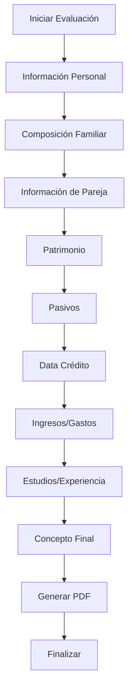

# 📚 Documentación Técnica Completa - Sistema de Evaluación de Visitas Domiciliarias

**Versión:** 4.0 - Optimizada con Base de Datos Real  
**Fecha:** 16 de septiembre de 2025  
**Propósito:** Guía completa para implementación en cualquier lenguaje de programación

---

## 🎯 **RESUMEN EJECUTIVO**

### **Descripción del Sistema**
Sistema web para gestión de evaluaciones de visitas domiciliarias con arquitectura modular, sistema de roles, autenticación robusta y generación de reportes PDF.

### **Características Técnicas Clave**
- **Arquitectura:** MVC con separación de responsabilidades
- **Base de Datos:** 78 tablas con relaciones complejas
- **Autenticación:** Session-based con rate limiting
- **Frontend:** MPA con validación en tiempo real
- **Reportes:** Generación de PDFs con plantillas dinámicas
- **Seguridad:** Validación de entrada, sanitización, logging

---

## 🗄️ **BASE DE DATOS REAL - ANÁLISIS COMPLETO**

### **Diagrama ER Principal**

```mermaid
erDiagram
    USUARIOS ||--o{ EVALUADOS : gestiona
    USUARIOS {
        int id PK
        string nombre
        int cedula
        int rol FK
        string correo
        string usuario UK
        string password
        boolean activo
        int intentos_fallidos
        timestamp bloqueado_hasta
        timestamp fecha_creacion
        timestamp fecha_actualizacion
    }
    
    ROLES ||--o{ USUARIOS : define
    ROLES {
        int id PK
        string nombre
    }
    
    EVALUADOS ||--o{ PATRIMONIO : tiene
    EVALUADOS ||--o{ PASIVOS : tiene
    EVALUADOS ||--o{ DATA_CREDITO : tiene
    EVALUADOS ||--o{ COMPOSICION_FAMILIAR : tiene
    EVALUADOS ||--o{ INFORMACION_PAREJA : tiene
    EVALUADOS ||--o{ CUENTAS_BANCARIAS : tiene
    EVALUADOS ||--o{ INGRESOS_MENSUALES : tiene
    EVALUADOS ||--o{ GASTO : tiene
    EVALUADOS ||--o{ ESTUDIOS : tiene
    EVALUADOS ||--o{ EXPERIENCIA_LABORAL : tiene
    EVALUADOS ||--o{ INFORMACION_JUDICIAL : tiene
    EVALUADOS ||--o{ CONCEPTO_FINAL_EVALUADOR : tiene
    EVALUADOS ||--o{ TIPO_VIVIENDA : tiene
    EVALUADOS ||--o{ ESTADO_VIVIENDA : tiene
    EVALUADOS ||--o{ INVENTARIO_ENSERES : tiene
    EVALUADOS ||--o{ SERVICIOS_PUBLICOS : tiene
    EVALUADOS ||--o{ ESTADOS_SALUD : tiene
    EVALUADOS ||--o{ CAMARA_COMERCIO : tiene
    EVALUADOS ||--o{ APORTANTE : tiene
    EVALUADOS ||--o{ OBSERVACIONES_ACADEMICAS : tiene
    EVALUADOS ||--o{ OBSERVACIONES_LABORALES : tiene
    EVALUADOS ||--o{ FIRMAS : tiene
    EVALUADOS ||--o{ EVIDENCIA_FOTOGRAFICA : tiene
    EVALUADOS ||--o{ UBICACION : tiene
    EVALUADOS ||--o{ FOTO_PERFIL_VISITA : tiene
    
    EVALUADOS {
        int id PK
        int id_cedula UK
        int id_tipo_documentos FK
        int cedula_expedida
        string nombres
        string apellidos
        int edad
        date fecha_expedicion
        string lugar_nacimiento
        int celular_1
        int celular_2
        string telefono
        int id_rh FK
        int id_estatura FK
        int peso_kg
        int id_estado_civil FK
        int hacer_cuanto
        int numero_hijos
        string direccion
        int id_ciudad FK
        string localidad
        string barrio
        int id_estrato FK
        string correo
        string cargo
        boolean tiene_multa_simit
        boolean tiene_tarjeta_militar
        text observacion
        timestamp fecha_creacion
    }
    
    PATRIMONIO {
        int id PK
        int id_cedula FK
        text valor_vivienda
        text direccion
        text id_vehiculo
        text id_marca
        text id_modelo
        text id_ahorro
        text otros
        text observacion
    }
    
    PASIVOS {
        int id PK
        int id_cedula FK
        text item
        text id_entidad
        text id_tipo_inversion
        int id_ciudad FK
        text deuda
        text cuota_mes
    }
    
    DATA_CREDITO {
        int id PK
        int id_cedula FK
        text entidad
        text cuotas
        text pago_mensual
        text deuda
    }
    
    COMPOSICION_FAMILIAR {
        int id PK
        int id_cedula FK
        string nombre
        int id_parentesco FK
        int edad
        int id_ocupacion FK
        string telefono
        string id_conviven
        text observacion
    }
    
    INFORMACION_PAREJA {
        int id PK
        int id_cedula FK
        int cedula
        int id_tipo_documentos FK
        int cedula_expedida
        string nombres
        int edad
        int id_genero FK
        int id_nivel_academico FK
        string actividad
        string empresa
        int antiguedad
        string direccion_empresa
        string telefono_1
        string telefono_2
        int vive_candidato
        text observacion
    }
    
    CUENTAS_BANCARIAS {
        int id PK
        int id_cedula FK
        text id_entidad
        text id_tipo_cuenta
        int id_ciudad FK
        string observaciones
    }
    
    INGRESOS_MENSUALES {
        int id PK
        int id_cedula FK
        text salario_val
        text pension_val
        text arriendo_val
        text trabajo_independiente_val
        text otros_val
    }
    
    GASTO {
        int id PK
        int id_cedula FK
        text alimentacion_val
        text educacion_val
        text salud_val
        text recreacion_val
        text cuota_creditos_val
        text arriendo_val
        text servicios_publicos_val
        text otros_val
    }
    
    ESTUDIOS {
        int id PK
        int id_cedula FK
        string centro_estudios
        text id_jornada
        int id_ciudad FK
        int anno
        text titulos
        text id_resultado
    }
    
    EXPERIENCIA_LABORAL {
        int id PK
        int id_cedula FK
        string empresa
        string tiempo
        string cargo
        string salario
        string retiro
        string concepto
        string nombre
        string numero
    }
    
    INFORMACION_JUDICIAL {
        int id PK
        int id_cedula FK
        int denuncias_opc
        text denuncias_desc
        int procesos_judiciales_opc
        text procesos_judiciales_desc
        int preso_opc
        text preso_desc
        int familia_detenido_opc
        text familia_detenido_desc
        int centros_penitenciarios_opc
        text centros_penitenciarios_desc
        text revi_fiscal
    }
    
    CONCEPTO_FINAL_EVALUADOR {
        int id PK
        int id_cedula FK
        string actitud
        string condiciones_vivienda
        string dinamica_familiar
        string condiciones_economicas
        string condiciones_academicas
        string evaluacion_experiencia_laboral
        string observaciones
        int id_concepto_final FK
        string nombre_evaluador
        int id_concepto_seguridad FK
    }
    
    TIPO_VIVIENDA {
        int id PK
        int id_cedula FK
        int id_tipo_vivienda FK
        int id_sector FK
        int id_propietario FK
        int numero_de_familia
        int personas_nucleo_familiar
        date tiempo_sector
        int numero_de_pisos
        text observacion
    }
    
    ESTADO_VIVIENDA {
        int id PK
        int id_cedula FK
        int id_estado FK
        text observacion
    }
    
    INVENTARIO_ENSERES {
        int id PK
        int id_cedula FK
        int televisor_cant
        int dvd_cant
        int teatro_casa_cant
        int equipo_sonido_cant
        int computador_cant
        int impresora_cant
        int movil_cant
        int estufa_cant
        int nevera_cant
        int lavadora_cant
        int microondas_cant
        int moto_cant
        int carro_cant
        text observacion
    }
    
    SERVICIOS_PUBLICOS {
        int id PK
        int id_cedula FK
        int agua
        int luz
        int gas
        int telefono
        int alcantarillado
        int internet
        int administracion
        int parqueadero
        text observacion
    }
    
    ESTADOS_SALUD {
        int id PK
        int id_cedula FK
        int id_estado_salud
        int tipo_enfermedad
        string tipo_enfermedad_cual
        int limitacion_fisica
        string limitacion_fisica_cual
        int tipo_medicamento
        string tipo_medicamento_cual
        int ingiere_alcohol
        string ingiere_alcohol_cual
        int fuma
        text observacion
    }
    
    CAMARA_COMERCIO {
        int id PK
        int id_cedula FK
        text tiene_camara
        text nombre
        text razon
        text activdad
        text observacion
    }
    
    APORTANTE {
        int id PK
        int id_cedula FK
        string nombre
        text valor
    }
    
    OBSERVACIONES_ACADEMICAS {
        int id PK
        string id_cedula FK
        text observacion
    }
    
    OBSERVACIONES_LABORALES {
        int id PK
        string id_cedula FK
        text observacion
    }
    
    FIRMAS {
        int id PK
        int id_cedula FK
        string ruta
        string nombre
    }
    
    EVIDENCIA_FOTOGRAFICA {
        int id PK
        int id_cedula FK
        string ruta
        string nombre
        int tipo
    }
    
    UBICACION {
        int id PK
        int id_cedula FK
        string longitud
        string latitud
    }
    
    FOTO_PERFIL_VISITA {
        int id PK
        int id_cedula FK
        text ruta
        string nombre
    }
    
    AUTORIZACIONES {
        int id PK
        int cedula UK
        string nombres
        string direccion
        string localidad
        string barrio
        string telefono
        int celular
        date fecha
        text autorizacion
        string correo
    }
    
    UBICACION_AUTORIZACION {
        int id PK
        int id_cedula FK
        text ruta
        text nombre
    }
    
    FOTO_PERFIL_AUTORIZACION {
        int id PK
        int id_cedula FK
        string ruta
        string nombre
    }
    
    UBICACION_FOTO {
        int id PK
        int id_cedula FK
        text ruta
        text nombre
    }
    
    DEPARTAMENTO {
        int id PK
        string departamento
    }
    
    MUNICIPIOS {
        int id_municipio PK
        string municipio
        int estado
        int departamento_id FK
    }
    
    EMPRESAS {
        int id PK
        string nombre
        int nit
    }
    
    OPCIONES {
        int id PK
        string nombre
    }
    
    FORMULARIOS {
        int id PK
        string nombre
        string codigo
        int version
    }
```


### **Diagrama de Flujo de Datos**


### **Diagrama de Arquitectura de Componentes**


### **Resumen de Tablas (78 tablas)**
```
Tablas Principales (18):
├── usuarios                    # Gestión de usuarios del sistema
├── evaluados                   # Datos principales de personas evaluadas
├── autorizaciones              # Cartas de autorización
├── patrimonio                  # Información patrimonial
├── pasivos                     # Deudas y obligaciones
├── data_credito                # Información crediticia
├── composicion_familiar        # Miembros de la familia
├── informacion_pareja          # Datos de pareja
├── cuentas_bancarias           # Cuentas bancarias
├── ingresos_mensuales          # Ingresos del hogar
├── gasto                       # Gastos del hogar
├── estudios                    # Información académica
├── experiencia_laboral         # Experiencia de trabajo
├── informacion_judicial        # Información legal
├── concepto_final_evaluador    # Evaluación final
├── tipo_vivienda               # Tipo de vivienda
├── estado_vivienda             # Estado de vivienda
└── inventario_enseres          # Bienes del hogar

Tablas de Opciones (35):
├── opc_tipo_documentos         # Tipos de documento
├── opc_estado_civiles          # Estados civiles
├── opc_genero                  # Géneros
├── opc_nivel_academico         # Niveles académicos
├── opc_ocupacion               # Ocupaciones
├── opc_parentesco              # Parentescos
├── opc_entidad                 # Entidades financieras
├── opc_tipo_cuenta             # Tipos de cuenta
├── opc_tipo_inversion          # Tipos de inversión
├── opc_vehiculo                # Tipos de vehículo
├── opc_marca                   # Marcas de vehículo
├── opc_modelo                  # Modelos de vehículo
├── opc_tipo_vivienda           # Tipos de vivienda
├── opc_sector                  # Sectores
├── opc_propiedad               # Tipos de propiedad
├── opc_estado_vivienda         # Estados de vivienda
├── opc_servicios_publicos      # Servicios públicos
├── opc_jornada                 # Jornadas académicas
├── opc_resultado               # Resultados académicos
├── opc_concepto_final          # Conceptos finales
├── opc_concepto_seguridad      # Conceptos de seguridad
├── opc_conviven                # Opciones de convivencia
├── opc_viven                   # Opciones de vivienda
├── opc_estados                 # Estados generales
├── opc_estaturas               # Estaturas
├── opc_estratos                # Estratos socioeconómicos
├── opc_rh                      # Tipos de sangre
├── opc_peso                    # Pesos
├── opc_num_hijos               # Número de hijos
├── opc_informacion_judicial    # Opciones judiciales
├── opc_inventario_enseres      # Opciones de inventario
├── opc_parametro               # Parámetros generales
├── opc_cuenta                  # Opciones de cuenta
├── opc_marca                   # Marcas generales
└── opc_modelo                  # Modelos generales

Tablas de Soporte (25):
├── departamento                # Departamentos
├── municipios                  # Municipios
├── empresas                    # Empresas
├── roles                       # Roles del sistema
├── opciones                    # Opciones generales
├── formularios                 # Formularios
├── firmas                      # Firmas digitales
├── evidencia_fotografica       # Evidencias fotográficas
├── foto_perfil_autorizacion    # Fotos de perfil autorización
├── foto_perfil_visita          # Fotos de perfil visita
├── ubicacion                   # Ubicaciones
├── ubicacion_autorizacion      # Ubicaciones de autorización
├── ubicacion_foto              # Fotos de ubicación
├── estados_salud               # Estados de salud
├── camara_comercio             # Información de cámara de comercio
├── servicios_publicos          # Servicios públicos
├── aportante                   # Aportantes al hogar
├── observaciones_academicas    # Observaciones académicas
├── observaciones_laborales     # Observaciones laborales
└── [5 tablas adicionales]
```

### **Estructura de Tabla USUARIOS (Real)**
```sql
CREATE TABLE `usuarios` (
    `id` int(11) NOT NULL AUTO_INCREMENT,
    `nombre` varchar(50) DEFAULT NULL,
    `cedula` int(20) DEFAULT NULL,
    `rol` int(11) DEFAULT NULL,
    `correo` varchar(50) DEFAULT NULL,
    `usuario` varchar(50) NOT NULL,
    `password` varchar(100) DEFAULT NULL,
    `fecha_creacion` timestamp NULL DEFAULT current_timestamp(),
    `activo` tinyint(1) DEFAULT 1 COMMENT 'Estado activo del usuario',
    `ultimo_acceso` timestamp NULL DEFAULT NULL COMMENT 'Último acceso del usuario',
    `intentos_fallidos` int(11) DEFAULT 0 COMMENT 'Contador de intentos fallidos',
    `bloqueado_hasta` timestamp NULL DEFAULT NULL COMMENT 'Fecha hasta cuando está bloqueado',
    `fecha_actualizacion` timestamp NULL DEFAULT current_timestamp() ON UPDATE current_timestamp(),
    PRIMARY KEY (`id`),
    KEY `idx_usuarios_activo` (`activo`),
    KEY `idx_usuarios_ultimo_acceso` (`ultimo_acceso`),
    KEY `idx_usuarios_intentos_fallidos` (`intentos_fallidos`),
    KEY `idx_usuarios_bloqueado_hasta` (`bloqueado_hasta`)
);
```

### **Estructura de Tabla EVALUADOS (Real)**
```sql
CREATE TABLE `evaluados` (
    `id` int(11) NOT NULL AUTO_INCREMENT,
    `id_cedula` int(11) DEFAULT NULL,
    `id_tipo_documentos` int(11) DEFAULT NULL,
    `cedula_expedida` int(11) DEFAULT NULL,
    `nombres` varchar(50) DEFAULT NULL,
    `apellidos` varchar(50) DEFAULT NULL,
    `edad` int(11) DEFAULT NULL,
    `fecha_expedicion` date DEFAULT NULL,
    `lugar_nacimiento` varchar(50) DEFAULT NULL,
    `celular_1` int(20) DEFAULT NULL,
    `celular_2` int(20) DEFAULT NULL,
    `telefono` varchar(50) DEFAULT NULL,
    `id_rh` int(11) DEFAULT NULL,
    `id_estatura` int(11) DEFAULT NULL,
    `peso_kg` int(11) DEFAULT NULL,
    `id_estado_civil` int(11) DEFAULT NULL,
    `hacer_cuanto` int(11) NOT NULL DEFAULT 0,
    `numero_hijos` int(11) DEFAULT NULL,
    `direccion` varchar(50) DEFAULT NULL,
    `id_ciudad` int(11) DEFAULT NULL,
    `localidad` varchar(50) DEFAULT NULL,
    `barrio` varchar(50) DEFAULT NULL,
    `id_estrato` int(11) DEFAULT NULL,
    `correo` varchar(50) DEFAULT NULL,
    `cargo` varchar(50) DEFAULT NULL,
    `tiene_multa_simit` tinyint(1) DEFAULT 0,
    `tiene_tarjeta_militar` tinyint(1) DEFAULT 0,
    `observacion` text NOT NULL DEFAULT 'N/A',
    `fecha_creacion` timestamp NULL DEFAULT current_timestamp(),
    PRIMARY KEY (`id`),
    UNIQUE KEY `id_cedula` (`id_cedula`)
);
```

### **Estructura de Tabla PATRIMONIO (Real)**
```sql
CREATE TABLE `patrimonio` (
    `id` int(11) NOT NULL AUTO_INCREMENT,
    `id_cedula` int(11) DEFAULT NULL,
    `valor_vivienda` text DEFAULT 'N/A',
    `direccion` text DEFAULT 'N/A',
    `id_vehiculo` text DEFAULT 'N/A',
    `id_marca` text DEFAULT 'N/A',
    `id_modelo` text DEFAULT 'N/A',
    `id_ahorro` text DEFAULT 'N/A',
    `otros` text DEFAULT 'N/A',
    `observacion` text NOT NULL DEFAULT 'N/A',
    PRIMARY KEY (`id`)
);
```

### **Estructura de Tabla PASIVOS (Real)**
```sql
CREATE TABLE `pasivos` (
    `id` int(11) NOT NULL AUTO_INCREMENT,
    `id_cedula` int(11) DEFAULT NULL,
    `item` text DEFAULT 'N/A',
    `id_entidad` text DEFAULT 'N/A',
    `id_tipo_inversion` text DEFAULT 'N/A',
    `id_ciudad` int(11) DEFAULT NULL,
    `deuda` text DEFAULT 'N/A',
    `cuota_mes` text DEFAULT 'N/A',
    PRIMARY KEY (`id`)
);
```

---

## 🔗 **RELACIONES COMPLETAS DE BASE DE DATOS**

### **Mapeo de Foreign Keys**
```sql
-- Relaciones principales
usuarios.rol → roles.id
evaluados.id_tipo_documentos → opc_tipo_documentos.id
evaluados.id_rh → opc_rh.id
evaluados.id_estatura → opc_estaturas.id
evaluados.id_estado_civil → opc_estado_civiles.id
evaluados.id_ciudad → municipios.id_municipio
evaluados.id_estrato → opc_estratos.id

-- Relaciones de patrimonio
patrimonio.id_cedula → evaluados.id_cedula
patrimonio.id_vehiculo → opc_vehiculo.id_vehiculo
patrimonio.id_marca → opc_marca.id_marca
patrimonio.id_modelo → opc_modelo.id_modelo

-- Relaciones de pasivos
pasivos.id_cedula → evaluados.id_cedula
pasivos.id_entidad → opc_entidad.id_entidad
pasivos.id_tipo_inversion → opc_tipo_inversion.id_tipo_inversion
pasivos.id_ciudad → municipios.id_municipio

-- Relaciones de composición familiar
composicion_familiar.id_cedula → evaluados.id_cedula
composicion_familiar.id_parentesco → opc_parentesco.id
composicion_familiar.id_ocupacion → opc_ocupacion.id

-- Relaciones de información de pareja
informacion_pareja.id_cedula → evaluados.id_cedula
informacion_pareja.id_tipo_documentos → opc_tipo_documentos.id
informacion_pareja.id_genero → opc_genero.id
informacion_pareja.id_nivel_academico → opc_nivel_academico.id

-- Relaciones de cuentas bancarias
cuentas_bancarias.id_cedula → evaluados.id_cedula
cuentas_bancarias.id_entidad → opc_entidad.id_entidad
cuentas_bancarias.id_tipo_cuenta → opc_tipo_cuenta.id_tipo_cuenta
cuentas_bancarias.id_ciudad → municipios.id_municipio

-- Relaciones de estudios
estudios.id_cedula → evaluados.id_cedula
estudios.id_jornada → opc_jornada.id_jornada
estudios.id_ciudad → municipios.id_municipio
estudios.id_resultado → opc_resultado.id_resultado

-- Relaciones de experiencia laboral
experiencia_laboral.id_cedula → evaluados.id_cedula

-- Relaciones de tipo vivienda
tipo_vivienda.id_cedula → evaluados.id_cedula
tipo_vivienda.id_tipo_vivienda → opc_tipo_vivienda.id
tipo_vivienda.id_sector → opc_sector.id
tipo_vivienda.id_propietario → opc_propiedad.id

-- Relaciones de estado vivienda
estado_vivienda.id_cedula → evaluados.id_cedula
estado_vivienda.id_estado → opc_estado_vivienda.id_estado

-- Relaciones de servicios públicos
servicios_publicos.id_cedula → evaluados.id_cedula

-- Relaciones de inventario enseres
inventario_enseres.id_cedula → evaluados.id_cedula

-- Relaciones de estados salud
estados_salud.id_cedula → evaluados.id_cedula

-- Relaciones de cámara comercio
camara_comercio.id_cedula → evaluados.id_cedula

-- Relaciones de aportante
aportante.id_cedula → evaluados.id_cedula

-- Relaciones de observaciones
observaciones_academicas.id_cedula → evaluados.id_cedula
observaciones_laborales.id_cedula → evaluados.id_cedula

-- Relaciones de firmas
firmas.id_cedula → evaluados.id_cedula

-- Relaciones de evidencia fotográfica
evidencia_fotografica.id_cedula → evaluados.id_cedula

-- Relaciones de ubicación
ubicacion.id_cedula → evaluados.id_cedula
ubicacion_autorizacion.id_cedula → evaluados.id_cedula
ubicacion_foto.id_cedula → evaluados.id_cedula

-- Relaciones de fotos
foto_perfil_visita.id_cedula → evaluados.id_cedula
foto_perfil_autorizacion.id_cedula → evaluados.id_cedula

-- Relaciones de concepto final
concepto_final_evaluador.id_cedula → evaluados.id_cedula
concepto_final_evaluador.id_concepto_final → opc_concepto_final.id_concepto_final
concepto_final_evaluador.id_concepto_seguridad → opc_concepto_seguridad.id_concepto_seguridad

-- Relaciones de municipios
municipios.departamento_id → departamento.id
```

### **Ejemplos de Consultas JOIN**
```sql
-- Consulta completa de evaluado con todas sus relaciones
SELECT 
    e.id_cedula,
    e.nombres,
    e.apellidos,
    e.edad,
    e.direccion,
    e.telefono,
    e.correo,
    td.nombre as tipo_documento,
    ec.nombre as estado_civil,
    rh.nombre as tipo_sangre,
    est.nombre as estatura,
    estr.nombre as estrato,
    m.municipio as ciudad,
    d.departamento
FROM evaluados e
LEFT JOIN opc_tipo_documentos td ON e.id_tipo_documentos = td.id
LEFT JOIN opc_estado_civiles ec ON e.id_estado_civil = ec.id
LEFT JOIN opc_rh rh ON e.id_rh = rh.id
LEFT JOIN opc_estaturas est ON e.id_estatura = est.id
LEFT JOIN opc_estratos estr ON e.id_estrato = estr.id
LEFT JOIN municipios m ON e.id_ciudad = m.id_municipio
LEFT JOIN departamento d ON m.departamento_id = d.id
WHERE e.id_cedula = ?;

-- Consulta de patrimonio con opciones
SELECT 
    p.id,
    p.valor_vivienda,
    p.direccion,
    p.id_ahorro,
    p.otros,
    v.nombre as tipo_vehiculo,
    ma.nombre as marca,
    mo.nombre as modelo
FROM patrimonio p
LEFT JOIN opc_vehiculo v ON p.id_vehiculo = v.id_vehiculo
LEFT JOIN opc_marca ma ON p.id_marca = ma.id_marca
LEFT JOIN opc_modelo mo ON p.id_modelo = mo.id_modelo
WHERE p.id_cedula = ?;

-- Consulta de pasivos con entidades
SELECT 
    p.id,
    p.item,
    p.deuda,
    p.cuota_mes,
    e.nombre as entidad,
    ti.nombre as tipo_inversion,
    m.municipio as ciudad
FROM pasivos p
LEFT JOIN opc_entidad e ON p.id_entidad = e.id_entidad
LEFT JOIN opc_tipo_inversion ti ON p.id_tipo_inversion = ti.id_tipo_inversion
LEFT JOIN municipios m ON p.id_ciudad = m.id_municipio
WHERE p.id_cedula = ?;

-- Consulta de composición familiar
SELECT 
    cf.id,
    cf.nombre,
    cf.edad,
    cf.telefono,
    p.nombre as parentesco,
    o.nombre as ocupacion
FROM composicion_familiar cf
LEFT JOIN opc_parentesco p ON cf.id_parentesco = p.id
LEFT JOIN opc_ocupacion o ON cf.id_ocupacion = o.id
WHERE cf.id_cedula = ?;

-- Consulta de estudios con opciones
SELECT 
    es.id,
    es.centro_estudios,
    es.anno,
    es.titulos,
    j.nombre as jornada,
    r.nombre as resultado,
    m.municipio as ciudad
FROM estudios es
LEFT JOIN opc_jornada j ON es.id_jornada = j.id_jornada
LEFT JOIN opc_resultado r ON es.id_resultado = r.id_resultado
LEFT JOIN municipios m ON es.id_ciudad = m.id_municipio
WHERE es.id_cedula = ?;

-- Consulta de experiencia laboral
SELECT 
    el.id,
    el.empresa,
    el.tiempo,
    el.cargo,
    el.salario,
    el.retiro,
    el.concepto
FROM experiencia_laboral el
WHERE el.id_cedula = ?;

-- Consulta de ingresos y gastos
SELECT 
    'ingresos' as tipo,
    im.salario_val as salario,
    im.pension_val as pension,
    im.arriendo_val as arriendo,
    im.trabajo_independiente_val as trabajo_independiente,
    im.otros_val as otros
FROM ingresos_mensuales im
WHERE im.id_cedula = ?
UNION ALL
SELECT 
    'gastos' as tipo,
    g.alimentacion_val as alimentacion,
    g.educacion_val as educacion,
    g.salud_val as salud,
    g.recreacion_val as recreacion,
    g.cuota_creditos_val as cuota_creditos
FROM gasto g
WHERE g.id_cedula = ?;

-- Consulta de resumen financiero
SELECT 
    e.id_cedula,
    e.nombres,
    e.apellidos,
    COALESCE(SUM(CAST(REPLACE(REPLACE(p.valor_vivienda, '$', ''), '.', '') AS DECIMAL(15,2))), 0) as total_patrimonio,
    COALESCE(SUM(CAST(REPLACE(REPLACE(pas.deuda, '$', ''), '.', '') AS DECIMAL(15,2))), 0) as total_pasivos,
    COALESCE(SUM(CAST(REPLACE(REPLACE(im.salario_val, '$', ''), '.', '') AS DECIMAL(15,2))), 0) as total_ingresos,
    COALESCE(SUM(CAST(REPLACE(REPLACE(g.alimentacion_val, '$', ''), '.', '') AS DECIMAL(15,2))), 0) as total_gastos
FROM evaluados e
LEFT JOIN patrimonio p ON e.id_cedula = p.id_cedula
LEFT JOIN pasivos pas ON e.id_cedula = pas.id_cedula
LEFT JOIN ingresos_mensuales im ON e.id_cedula = im.id_cedula
LEFT JOIN gasto g ON e.id_cedula = g.id_cedula
WHERE e.id_cedula = ?
GROUP BY e.id_cedula, e.nombres, e.apellidos;
```

### **Restricciones de Integridad**
```sql
-- Restricciones de integridad referencial
ALTER TABLE usuarios ADD CONSTRAINT fk_usuarios_rol 
    FOREIGN KEY (rol) REFERENCES roles(id) ON DELETE RESTRICT ON UPDATE CASCADE;

ALTER TABLE evaluados ADD CONSTRAINT fk_evaluados_tipo_documento 
    FOREIGN KEY (id_tipo_documentos) REFERENCES opc_tipo_documentos(id) ON DELETE RESTRICT ON UPDATE CASCADE;

ALTER TABLE evaluados ADD CONSTRAINT fk_evaluados_estado_civil 
    FOREIGN KEY (id_estado_civil) REFERENCES opc_estado_civiles(id) ON DELETE RESTRICT ON UPDATE CASCADE;

ALTER TABLE evaluados ADD CONSTRAINT fk_evaluados_ciudad 
    FOREIGN KEY (id_ciudad) REFERENCES municipios(id_municipio) ON DELETE RESTRICT ON UPDATE CASCADE;

ALTER TABLE patrimonio ADD CONSTRAINT fk_patrimonio_cedula 
    FOREIGN KEY (id_cedula) REFERENCES evaluados(id_cedula) ON DELETE CASCADE ON UPDATE CASCADE;

ALTER TABLE pasivos ADD CONSTRAINT fk_pasivos_cedula 
    FOREIGN KEY (id_cedula) REFERENCES evaluados(id_cedula) ON DELETE CASCADE ON UPDATE CASCADE;

ALTER TABLE composicion_familiar ADD CONSTRAINT fk_composicion_cedula 
    FOREIGN KEY (id_cedula) REFERENCES evaluados(id_cedula) ON DELETE CASCADE ON UPDATE CASCADE;

ALTER TABLE informacion_pareja ADD CONSTRAINT fk_pareja_cedula 
    FOREIGN KEY (id_cedula) REFERENCES evaluados(id_cedula) ON DELETE CASCADE ON UPDATE CASCADE;

ALTER TABLE cuentas_bancarias ADD CONSTRAINT fk_cuentas_cedula 
    FOREIGN KEY (id_cedula) REFERENCES evaluados(id_cedula) ON DELETE CASCADE ON UPDATE CASCADE;

ALTER TABLE ingresos_mensuales ADD CONSTRAINT fk_ingresos_cedula 
    FOREIGN KEY (id_cedula) REFERENCES evaluados(id_cedula) ON DELETE CASCADE ON UPDATE CASCADE;

ALTER TABLE gasto ADD CONSTRAINT fk_gasto_cedula 
    FOREIGN KEY (id_cedula) REFERENCES evaluados(id_cedula) ON DELETE CASCADE ON UPDATE CASCADE;

ALTER TABLE estudios ADD CONSTRAINT fk_estudios_cedula 
    FOREIGN KEY (id_cedula) REFERENCES evaluados(id_cedula) ON DELETE CASCADE ON UPDATE CASCADE;

ALTER TABLE experiencia_laboral ADD CONSTRAINT fk_experiencia_cedula 
    FOREIGN KEY (id_cedula) REFERENCES evaluados(id_cedula) ON DELETE CASCADE ON UPDATE CASCADE;

ALTER TABLE informacion_judicial ADD CONSTRAINT fk_judicial_cedula 
    FOREIGN KEY (id_cedula) REFERENCES evaluados(id_cedula) ON DELETE CASCADE ON UPDATE CASCADE;

ALTER TABLE concepto_final_evaluador ADD CONSTRAINT fk_concepto_cedula 
    FOREIGN KEY (id_cedula) REFERENCES evaluados(id_cedula) ON DELETE CASCADE ON UPDATE CASCADE;

ALTER TABLE tipo_vivienda ADD CONSTRAINT fk_tipo_vivienda_cedula 
    FOREIGN KEY (id_cedula) REFERENCES evaluados(id_cedula) ON DELETE CASCADE ON UPDATE CASCADE;

ALTER TABLE estado_vivienda ADD CONSTRAINT fk_estado_vivienda_cedula 
    FOREIGN KEY (id_cedula) REFERENCES evaluados(id_cedula) ON DELETE CASCADE ON UPDATE CASCADE;

ALTER TABLE inventario_enseres ADD CONSTRAINT fk_inventario_cedula 
    FOREIGN KEY (id_cedula) REFERENCES evaluados(id_cedula) ON DELETE CASCADE ON UPDATE CASCADE;

ALTER TABLE servicios_publicos ADD CONSTRAINT fk_servicios_cedula 
    FOREIGN KEY (id_cedula) REFERENCES evaluados(id_cedula) ON DELETE CASCADE ON UPDATE CASCADE;

ALTER TABLE estados_salud ADD CONSTRAINT fk_salud_cedula 
    FOREIGN KEY (id_cedula) REFERENCES evaluados(id_cedula) ON DELETE CASCADE ON UPDATE CASCADE;

ALTER TABLE camara_comercio ADD CONSTRAINT fk_camara_cedula 
    FOREIGN KEY (id_cedula) REFERENCES evaluados(id_cedula) ON DELETE CASCADE ON UPDATE CASCADE;

ALTER TABLE aportante ADD CONSTRAINT fk_aportante_cedula 
    FOREIGN KEY (id_cedula) REFERENCES evaluados(id_cedula) ON DELETE CASCADE ON UPDATE CASCADE;

ALTER TABLE observaciones_academicas ADD CONSTRAINT fk_obs_academicas_cedula 
    FOREIGN KEY (id_cedula) REFERENCES evaluados(id_cedula) ON DELETE CASCADE ON UPDATE CASCADE;

ALTER TABLE observaciones_laborales ADD CONSTRAINT fk_obs_laborales_cedula 
    FOREIGN KEY (id_cedula) REFERENCES evaluados(id_cedula) ON DELETE CASCADE ON UPDATE CASCADE;

ALTER TABLE firmas ADD CONSTRAINT fk_firmas_cedula 
    FOREIGN KEY (id_cedula) REFERENCES evaluados(id_cedula) ON DELETE CASCADE ON UPDATE CASCADE;

ALTER TABLE evidencia_fotografica ADD CONSTRAINT fk_evidencia_cedula 
    FOREIGN KEY (id_cedula) REFERENCES evaluados(id_cedula) ON DELETE CASCADE ON UPDATE CASCADE;

ALTER TABLE ubicacion ADD CONSTRAINT fk_ubicacion_cedula 
    FOREIGN KEY (id_cedula) REFERENCES evaluados(id_cedula) ON DELETE CASCADE ON UPDATE CASCADE;

ALTER TABLE foto_perfil_visita ADD CONSTRAINT fk_foto_visita_cedula 
    FOREIGN KEY (id_cedula) REFERENCES evaluados(id_cedula) ON DELETE CASCADE ON UPDATE CASCADE;

ALTER TABLE municipios ADD CONSTRAINT fk_municipios_departamento 
    FOREIGN KEY (departamento_id) REFERENCES departamento(id) ON DELETE RESTRICT ON UPDATE CASCADE;

-- Restricciones de unicidad
ALTER TABLE usuarios ADD CONSTRAINT uk_usuarios_usuario UNIQUE (usuario);
ALTER TABLE usuarios ADD CONSTRAINT uk_usuarios_correo UNIQUE (correo);
ALTER TABLE evaluados ADD CONSTRAINT uk_evaluados_cedula UNIQUE (id_cedula);
ALTER TABLE autorizaciones ADD CONSTRAINT uk_autorizaciones_cedula UNIQUE (cedula);
ALTER TABLE firmas ADD CONSTRAINT uk_firmas_cedula UNIQUE (id_cedula);
ALTER TABLE ubicacion_autorizacion ADD CONSTRAINT uk_ubicacion_auth_cedula UNIQUE (id_cedula);
ALTER TABLE foto_perfil_autorizacion ADD CONSTRAINT uk_foto_auth_cedula UNIQUE (id_cedula);

-- Restricciones de validación
ALTER TABLE evaluados ADD CONSTRAINT chk_evaluados_edad CHECK (edad >= 18 AND edad <= 100);
ALTER TABLE evaluados ADD CONSTRAINT chk_evaluados_cedula CHECK (id_cedula > 0);
ALTER TABLE usuarios ADD CONSTRAINT chk_usuarios_activo CHECK (activo IN (0, 1));
ALTER TABLE usuarios ADD CONSTRAINT chk_usuarios_intentos CHECK (intentos_fallidos >= 0);
ALTER TABLE patrimonio ADD CONSTRAINT chk_patrimonio_valor CHECK (valor_vivienda IS NULL OR valor_vivienda REGEXP '^\\$?[0-9]{1,3}(\\.[0-9]{3})*,[0-9]{2}$');
ALTER TABLE pasivos ADD CONSTRAINT chk_pasivos_deuda CHECK (deuda IS NULL OR deuda REGEXP '^\\$?[0-9]{1,3}(\\.[0-9]{3})*,[0-9]{2}$');
ALTER TABLE pasivos ADD CONSTRAINT chk_pasivos_cuota CHECK (cuota_mes IS NULL OR cuota_mes REGEXP '^\\$?[0-9]{1,3}(\\.[0-9]{3})*,[0-9]{2}$');
```

---

## 🎯 **CASOS DE USO Y FLUJOS DE USUARIO**

### **Caso de Uso 1: Evaluación Completa de Visitante**


### **Caso de Uso 2: Búsqueda y Filtrado de Evaluados**


### **Caso de Uso 3: Generación de Reportes PDF**


### **Escenarios de Prueba**

#### **Escenario 1: Evaluación Exitosa**
```javascript
const testCase = {
    name: "Evaluación completa exitosa",
    steps: [
        "1. Usuario inicia sesión con credenciales válidas",
        "2. Usuario crea nueva evaluación",
        "3. Usuario completa información personal",
        "4. Usuario agrega composición familiar",
        "5. Usuario completa patrimonio",
        "6. Usuario completa pasivos",
        "7. Usuario completa data crédito",
        "8. Usuario completa ingresos y gastos",
        "9. Usuario completa estudios",
        "10. Usuario completa experiencia laboral",
        "11. Usuario completa información judicial",
        "12. Usuario completa estado de vivienda",
        "13. Usuario completa tipo de vivienda",
        "14. Usuario completa inventario de enseres",
        "15. Usuario completa servicios públicos",
        "16. Usuario completa estados de salud",
        "17. Usuario completa cámara de comercio",
        "18. Usuario completa aportantes",
        "19. Usuario completa concepto final",
        "20. Usuario genera PDF",
        "21. Sistema guarda evaluación completa"
    ],
    expectedResult: "Evaluación guardada exitosamente con PDF generado",
    dataValidation: [
        "Todos los campos obligatorios completados",
        "Formato de moneda válido",
        "Relaciones de base de datos correctas",
        "PDF generado sin errores"
    ]
};
```

#### **Escenario 2: Manejo de Errores**
```javascript
const errorScenarios = {
    authentication: {
        name: "Error de autenticación",
        steps: [
            "1. Usuario ingresa credenciales incorrectas",
            "2. Sistema valida credenciales",
            "3. Sistema incrementa contador de intentos fallidos",
            "4. Sistema bloquea usuario después de 5 intentos",
            "5. Sistema muestra mensaje de error"
        ],
        expectedResult: "Usuario bloqueado por 15 minutos",
        errorHandling: "Rate limiting activado"
    },
    
    validation: {
        name: "Error de validación de datos",
        steps: [
            "1. Usuario ingresa formato de moneda incorrecto",
            "2. Sistema valida formato",
            "3. Sistema muestra error de validación",
            "4. Usuario corrige formato",
            "5. Sistema acepta datos"
        ],
        expectedResult: "Datos validados correctamente",
        errorHandling: "Validación en tiempo real"
    },
    
    database: {
        name: "Error de base de datos",
        steps: [
            "1. Usuario intenta guardar datos",
            "2. Sistema intenta conectar a base de datos",
            "3. Conexión falla",
            "4. Sistema muestra error de conexión",
            "5. Sistema registra error en logs"
        ],
        expectedResult: "Error manejado gracefully",
        errorHandling: "Logging y notificación de errores"
    },
    
    pdf: {
        name: "Error en generación de PDF",
        steps: [
            "1. Usuario solicita generación de PDF",
            "2. Sistema intenta generar PDF",
            "3. Error en procesamiento de datos",
            "4. Sistema muestra error de generación",
            "5. Sistema ofrece reintentar"
        ],
        expectedResult: "Error manejado con opción de reintento",
        errorHandling: "Retry mechanism implementado"
    }
};
```

#### **Escenario 3: Edge Cases**
```javascript
const edgeCases = {
    largeData: {
        name: "Manejo de grandes volúmenes de datos",
        scenario: "Evaluado con 50+ familiares, 20+ pasivos, 30+ estudios",
        handling: [
            "Paginación en frontend",
            "Lazy loading de datos",
            "Optimización de consultas",
            "Cache de datos frecuentes"
        ]
    },
    
    concurrentUsers: {
        name: "Múltiples usuarios simultáneos",
        scenario: "100+ usuarios evaluando al mismo tiempo",
        handling: [
            "Connection pooling",
            "Rate limiting por usuario",
            "Queue de procesamiento",
            "Load balancing"
        ]
    },
    
    networkIssues: {
        name: "Problemas de conectividad",
        scenario: "Conexión intermitente durante evaluación",
        handling: [
            "Auto-save cada 30 segundos",
            "Retry automático en fallos",
            "Offline mode básico",
            "Sincronización al reconectar"
        ]
    },
    
    dataCorruption: {
        name: "Corrupción de datos",
        scenario: "Datos inconsistentes en base de datos",
        handling: [
            "Validación de integridad",
            "Backup automático",
            "Recovery procedures",
            "Data validation scripts"
        ]
    }
};
```

---

## 🔐 **SISTEMA DE AUTENTICACIÓN Y AUTORIZACIÓN**

### **Estructura de Roles (Real)**
```sql
CREATE TABLE `roles` (
    `id` int(11) NOT NULL AUTO_INCREMENT,
    `nombre` varchar(50) DEFAULT NULL,
    PRIMARY KEY (`id`)
);
```

### **Configuración de Autenticación**
```javascript
const authConfig = {
    session: {
        timeout: 24 * 60 * 60 * 1000,  // 24 horas
        regenerate: true,
        secure: true
    },
    rateLimit: {
        windowMs: 15 * 60 * 1000,      // 15 minutos
        maxAttempts: 5,                // 5 intentos máximo
        blockDuration: 15 * 60 * 1000  // Bloqueo por 15 min
    },
    password: {
        minLength: 8,
        requireUppercase: true,
        requireLowercase: true,
        requireNumbers: true,
        requireSpecialChars: true
    }
};
```

### **Flujo de Autenticación**


---

## 🔧 **API ENDPOINTS Y CONTRATOS**

### **Autenticación**
```javascript
// POST /login
{
    "usuario": "string",
    "password": "string"
}
// Response
{
    "success": true,
    "user": {
        "id": 1,
        "nombre": "Admin",
        "rol": 1,
        "activo": true
    },
    "session": "session_id_here"
}

// POST /logout
// Response: { "success": true, "message": "Logged out successfully" }
```

### **Gestión de Evaluados**
```javascript
// GET /evaluados
// Query: ?page=1&limit=10&search=nombre
// Response
{
    "success": true,
    "data": [
        {
            "id": 1,
            "id_cedula": 12345678,
            "nombres": "Juan",
            "apellidos": "Pérez",
            "edad": 30,
            "direccion": "Calle 123 #45-67",
            "fecha_creacion": "2025-09-16T10:30:00Z"
        }
    ],
    "pagination": {
        "page": 1,
        "limit": 10,
        "total": 50,
        "pages": 5
    }
}

// POST /evaluados
{
    "id_cedula": 12345678,
    "nombres": "Juan",
    "apellidos": "Pérez",
    "edad": 30,
    "direccion": "Calle 123 #45-67",
    "telefono": "3001234567",
    "correo": "juan@email.com"
}

// PUT /evaluados/{id}
// DELETE /evaluados/{id}
```

### **Módulos de Evaluación**
```javascript
// GET /evaluados/{cedula}/patrimonio
// POST /evaluados/{cedula}/patrimonio
{
    "valor_vivienda": "$150.000.000",
    "direccion": "Calle 123 #45-67",
    "id_vehiculo": "1",
    "id_marca": "2",
    "id_modelo": "3",
    "id_ahorro": "$5.000.000",
    "otros": "$2.000.000"
}

// GET /evaluados/{cedula}/pasivos
// POST /evaluados/{cedula}/pasivos
{
    "item": "Tarjeta de crédito",
    "id_entidad": "1",
    "id_tipo_inversion": "1",
    "deuda": "$2.000.000",
    "cuota_mes": "$200.000"
}

// GET /evaluados/{cedula}/data_credito
// POST /evaluados/{cedula}/data_credito
{
    "entidad": "Banco Popular",
    "cuotas": "12",
    "pago_mensual": "$500.000",
    "deuda": "$6.000.000"
}
```

---

## 💰 **VALIDACIÓN Y FORMATO DE MONEDA**

### **Especificaciones de Formato Colombiano**
```javascript
const currencyConfig = {
    locale: 'es-CO',
    currency: 'COP',
    format: {
        symbol: '$',
        decimal: ',',
        thousands: '.',
        precision: 2
    },
    validation: {
        min: 0,
        max: 999999999999.99,
        pattern: /^\$?[\d]{1,3}(\.[\d]{3})*,[\d]{2}$/
    }
};
```

### **Algoritmo de Validación**
```javascript
function validateCurrency(value) {
    // 1. Remover símbolos y espacios
    const cleanValue = value.replace(/[\s$]/g, '');
    
    // 2. Validar formato colombiano
    const pattern = /^[\d]{1,3}(\.[\d]{3})*,[\d]{2}$/;
    if (!pattern.test(cleanValue)) {
        return { valid: false, error: 'Formato inválido' };
    }
    
    // 3. Convertir a número
    const numericValue = parseFloat(cleanValue.replace(/\./g, '').replace(',', '.'));
    
    // 4. Validar rango
    if (numericValue < 0 || numericValue > 999999999999.99) {
        return { valid: false, error: 'Valor fuera de rango' };
    }
    
    return { valid: true, value: numericValue };
}
```

### **Formateo en Frontend**
```javascript
// Usando Cleave.js
const cleaveConfig = {
    numeral: true,
    numeralThousandsGroupStyle: 'thousand',
    numeralDecimalMark: ',',
    delimiter: '.',
    numeralDecimalScale: 2,
    prefix: '$'
};
```

---

## 📊 **LÓGICA DE NEGOCIO**

### **Flujo de Evaluación**


### **Reglas de Validación**
```javascript
const businessRules = {
    evaluado: {
        id_cedula: {
            required: true,
            pattern: /^[\d]{6,12}$/,
            unique: true
        },
        nombres: {
            required: true,
            minLength: 2,
            maxLength: 50
        },
        apellidos: {
            required: true,
            minLength: 2,
            maxLength: 50
        },
        edad: {
            required: true,
            min: 18,
            max: 100
        }
    },
    patrimonio: {
        valor_vivienda: {
            required: false,
            format: 'currency',
            min: 0,
            max: 999999999999.99
        }
    },
    pasivos: {
        deuda: {
            required: true,
            format: 'currency',
            min: 0,
            max: 999999999999.99
        },
        cuota_mes: {
            required: true,
            format: 'currency',
            min: 0,
            max: 999999999.99
        }
    }
};
```

### **Cálculos Automáticos**
```javascript
function calculateFinancialSummary(evaluado) {
    const patrimonio = evaluado.patrimonio || [];
    const pasivos = evaluado.pasivos || [];
    const ingresos = evaluado.ingresos_mensuales || [];
    const gastos = evaluado.gasto || [];
    
    const totalPatrimonio = patrimonio.reduce((sum, item) => {
        return sum + parseFloat(item.valor_vivienda?.replace(/[$,.]/g, '') || 0);
    }, 0);
    
    const totalPasivos = pasivos.reduce((sum, item) => {
        return sum + parseFloat(item.deuda?.replace(/[$,.]/g, '') || 0);
    }, 0);
    
    const totalIngresos = ingresos.reduce((sum, item) => {
        return sum + parseFloat(item.salario_val?.replace(/[$,.]/g, '') || 0);
    }, 0);
    
    const totalGastos = gastos.reduce((sum, item) => {
        return sum + parseFloat(item.alimentacion_val?.replace(/[$,.]/g, '') || 0);
    }, 0);
    
    return {
        patrimonio_neto: totalPatrimonio - totalPasivos,
        capacidad_pago: totalIngresos - totalGastos,
        ratio_endeudamiento: totalPasivos / totalPatrimonio,
        recomendacion: generateRecommendation(totalPatrimonio, totalPasivos, totalIngresos, totalGastos)
    };
}
```

---

## 🎨 **ESPECIFICACIONES DE UI/UX**

### **Sistema de Diseño**
```css
:root {
    /* Colores principales */
    --primary-color: #11998e;
    --primary-gradient: linear-gradient(135deg, #11998e 0%, #38ef7d 100%);
    --secondary-color: #f8f9fa;
    --accent-color: #007bff;
    
    /* Colores de estado */
    --success-color: #28a745;
    --warning-color: #ffc107;
    --error-color: #dc3545;
    --info-color: #17a2b8;
    
    /* Tipografía */
    --font-family: 'Inter', -apple-system, BlinkMacSystemFont, sans-serif;
    --font-size-base: 16px;
    --line-height-base: 1.5;
    
    /* Espaciado */
    --spacing-xs: 0.25rem;
    --spacing-sm: 0.5rem;
    --spacing-md: 1rem;
    --spacing-lg: 1.5rem;
    --spacing-xl: 3rem;
    
    /* Bordes */
    --border-radius: 0.375rem;
    --border-width: 1px;
    --border-color: #dee2e6;
}
```

### **Componentes Reutilizables**
```javascript
// Componente de Formulario
const FormComponent = {
    props: ['fields', 'validation', 'onSubmit'],
    template: `
        <form @submit.prevent="handleSubmit">
            <div v-for="field in fields" :key="field.name" class="form-group">
                <label :for="field.name">{{ field.label }}</label>
                <input 
                    :type="field.type"
                    :id="field.name"
                    v-model="formData[field.name]"
                    :class="getFieldClass(field.name)"
                    :required="field.required"
                />
                <div v-if="errors[field.name]" class="error-message">
                    {{ errors[field.name] }}
                </div>
            </div>
            <button type="submit" :disabled="!isValid">Guardar</button>
        </form>
    `
};
```

---

## 📄 **GENERACIÓN DE REPORTES PDF**

### **Estructura de Datos para PDF**
```javascript
const pdfDataStructure = {
    evaluado: {
        id: 1,
        cedula: 12345678,
        nombres: "Juan",
        apellidos: "Pérez",
        direccion: "Calle 123 #45-67",
        telefono: "3001234567",
        correo: "juan@email.com"
    },
    modulos: {
        patrimonio: {
            valor_vivienda: "$150.000.000",
            direccion: "Calle 123 #45-67",
            vehiculo: "Toyota Corolla 2020",
            ahorro: "$5.000.000",
            otros: "$2.000.000"
        },
        pasivos: [
            {
                item: "Tarjeta de crédito",
                entidad: "Banco Popular",
                deuda: "$2.000.000",
                cuota_mes: "$200.000"
            }
        ],
        ingresos: {
            salario: "$3.000.000",
            pension: "$0",
            arriendo: "$0",
            trabajo_independiente: "$500.000",
            otros: "$0"
        },
        gastos: {
            alimentacion: "$800.000",
            educacion: "$200.000",
            salud: "$150.000",
            recreacion: "$100.000",
            cuota_creditos: "$200.000",
            arriendo: "$0",
            servicios_publicos: "$300.000",
            otros: "$100.000"
        }
    },
    resumen: {
        patrimonio_total: 157000000,
        pasivos_total: 2000000,
        patrimonio_neto: 155000000,
        ingresos_total: 3500000,
        gastos_total: 1850000,
        capacidad_pago: 1650000
    }
};
```

### **Algoritmo de Generación**
```javascript
function generatePDF(evaluadoData) {
    const sections = [
        'header',
        'informacion_personal',
        'patrimonio',
        'pasivos',
        'ingresos_gastos',
        'resumen_financiero',
        'concepto_final',
        'firma'
    ];
    
    const pdfContent = sections.map(section => {
        return renderSection(section, evaluadoData);
    }).join('');
    
    return compilePDF(pdfContent, pdfConfig);
}
```

---

## 🧪 **ESTRATEGIA DE PRUEBAS**

### **Casos de Prueba Críticos**
```javascript
const testCases = {
    authentication: [
        'login_with_valid_credentials',
        'login_with_invalid_credentials',
        'rate_limiting_after_failed_attempts',
        'session_timeout',
        'logout_functionality'
    ],
    data_validation: [
        'currency_format_validation',
        'required_field_validation',
        'data_type_validation',
        'business_rule_validation'
    ],
    database: [
        'create_evaluado',
        'update_evaluado',
        'delete_evaluado',
        'create_patrimonio',
        'create_pasivos',
        'create_data_credito'
    ],
    pdf_generation: [
        'pdf_creation_with_valid_data',
        'pdf_creation_with_missing_data',
        'pdf_format_validation',
        'pdf_download_functionality'
    ]
};
```

---

## ⚙️ **CONFIGURACIÓN AVANZADA Y VARIABLES DE ENTORNO**

### **Variables de Entorno Específicas**
```bash
# Configuración de Base de Datos
DB_HOST=localhost
DB_PORT=3306
DB_NAME=u130454517_modulo_vista
DB_USER=u130454517_modulo_vista
DB_PASSWORD=tu_password_seguro
DB_CHARSET=utf8mb4
DB_COLLATION=utf8mb4_unicode_ci

# Configuración de Sesiones
SESSION_DRIVER=file
SESSION_LIFETIME=1440
SESSION_ENCRYPT=false
SESSION_PATH=/tmp
SESSION_DOMAIN=localhost
SESSION_SECURE=false
SESSION_HTTP_ONLY=true
SESSION_SAME_SITE=lax

# Configuración de Autenticación
AUTH_RATE_LIMIT=5
AUTH_BLOCK_DURATION=900
AUTH_PASSWORD_MIN_LENGTH=8
AUTH_PASSWORD_REQUIRE_UPPERCASE=true
AUTH_PASSWORD_REQUIRE_LOWERCASE=true
AUTH_PASSWORD_REQUIRE_NUMBERS=true
AUTH_PASSWORD_REQUIRE_SPECIAL_CHARS=true

# Configuración de Archivos
FILE_MAX_SIZE=10485760
FILE_ALLOWED_TYPES=jpg,jpeg,png,pdf,doc,docx
FILE_UPLOAD_PATH=/uploads
FILE_TEMP_PATH=/tmp
FILE_BACKUP_PATH=/backups

# Configuración de PDF
PDF_ENGINE=dompdf
PDF_TEMP_PATH=/tmp/pdf
PDF_CACHE_PATH=/cache/pdf
PDF_MAX_MEMORY=128M
PDF_MAX_EXECUTION_TIME=300

# Configuración de Logging
LOG_LEVEL=info
LOG_CHANNEL=file
LOG_PATH=/logs
LOG_MAX_FILES=30
LOG_MAX_SIZE=10485760

# Configuración de Cache
CACHE_DRIVER=file
CACHE_PREFIX=evaluacion_
CACHE_TTL=3600
CACHE_PATH=/cache

# Configuración de Email
MAIL_DRIVER=smtp
MAIL_HOST=smtp.gmail.com
MAIL_PORT=587
MAIL_USERNAME=tu_email@gmail.com
MAIL_PASSWORD=tu_password_app
MAIL_ENCRYPTION=tls
MAIL_FROM_ADDRESS=noreply@sistema.com
MAIL_FROM_NAME="Sistema de Evaluaciones"

# Configuración de Seguridad
APP_KEY=base64:tu_clave_secreta_aqui
APP_ENV=production
APP_DEBUG=false
APP_URL=https://tu-dominio.com

# Configuración de Rate Limiting
RATE_LIMIT_ENABLED=true
RATE_LIMIT_REQUESTS=100
RATE_LIMIT_WINDOW=60
RATE_LIMIT_STORAGE=file

# Configuración de Backup
BACKUP_ENABLED=true
BACKUP_SCHEDULE=0 2 * * *
BACKUP_RETENTION_DAYS=30
BACKUP_COMPRESSION=true
BACKUP_ENCRYPTION=false

# Configuración de Monitoreo
MONITORING_ENABLED=true
MONITORING_METRICS=true
MONITORING_ALERTS=true
MONITORING_WEBHOOK_URL=https://hooks.slack.com/...

# Configuración de API
API_RATE_LIMIT=1000
API_RATE_WINDOW=3600
API_VERSION=v1
API_PREFIX=api

# Configuración de Frontend
FRONTEND_URL=https://tu-dominio.com
FRONTEND_CACHE_TTL=3600
FRONTEND_CDN_URL=https://cdn.tu-dominio.com
FRONTEND_ASSETS_VERSION=1.0.0
```

### **Configuración de Servidor**

#### **Nginx Configuration**
```nginx
server {
    listen 80;
    listen 443 ssl http2;
    server_name tu-dominio.com www.tu-dominio.com;
    
    # SSL Configuration
    ssl_certificate /path/to/certificate.crt;
    ssl_certificate_key /path/to/private.key;
    ssl_protocols TLSv1.2 TLSv1.3;
    ssl_ciphers ECDHE-RSA-AES256-GCM-SHA512:DHE-RSA-AES256-GCM-SHA512;
    ssl_prefer_server_ciphers off;
    
    # Security Headers
    add_header X-Frame-Options "SAMEORIGIN" always;
    add_header X-XSS-Protection "1; mode=block" always;
    add_header X-Content-Type-Options "nosniff" always;
    add_header Referrer-Policy "no-referrer-when-downgrade" always;
    add_header Content-Security-Policy "default-src 'self' http: https: data: blob: 'unsafe-inline'" always;
    
    # Root directory
    root /var/www/html/ModuStackVisit_2;
    index index.php index.html;
    
    # PHP Configuration
    location ~ \.php$ {
        fastcgi_pass unix:/var/run/php/php8.2-fpm.sock;
        fastcgi_index index.php;
        fastcgi_param SCRIPT_FILENAME $realpath_root$fastcgi_script_name;
        include fastcgi_params;
        
        # Security
        fastcgi_hide_header X-Powered-By;
        fastcgi_read_timeout 300;
        fastcgi_send_timeout 300;
    }
    
    # File uploads
    client_max_body_size 50M;
    client_body_timeout 60s;
    client_header_timeout 60s;
    
    # Gzip compression
    gzip on;
    gzip_vary on;
    gzip_min_length 1024;
    gzip_proxied any;
    gzip_comp_level 6;
    gzip_types
        text/plain
        text/css
        text/xml
        text/javascript
        application/json
        application/javascript
        application/xml+rss
        application/atom+xml
        image/svg+xml;
    
    # Cache static files
    location ~* \.(jpg|jpeg|png|gif|ico|css|js|pdf|doc|docx)$ {
        expires 1y;
        add_header Cache-Control "public, immutable";
    }
    
    # Security - deny access to sensitive files
    location ~ /\. {
        deny all;
    }
    
    location ~ /(config|logs|backups)/ {
        deny all;
    }
    
    # Rate limiting
    limit_req_zone $binary_remote_addr zone=login:10m rate=5r/m;
    limit_req_zone $binary_remote_addr zone=api:10m rate=100r/m;
    
    location /login {
        limit_req zone=login burst=5 nodelay;
        try_files $uri $uri/ /index.php?$query_string;
    }
    
    location /api/ {
        limit_req zone=api burst=20 nodelay;
        try_files $uri $uri/ /index.php?$query_string;
    }
}
```

#### **PHP-FPM Configuration**
```ini
; /etc/php/8.2/fpm/pool.d/www.conf
[www]
user = www-data
group = www-data
listen = /var/run/php/php8.2-fpm.sock
listen.owner = www-data
listen.group = www-data
listen.mode = 0660

pm = dynamic
pm.max_children = 50
pm.start_servers = 5
pm.min_spare_servers = 5
pm.max_spare_servers = 35
pm.max_requests = 1000

; Security
php_admin_value[disable_functions] = exec,passthru,shell_exec,system,proc_open,popen,curl_exec,curl_multi_exec,parse_ini_file,show_source
php_admin_value[allow_url_fopen] = Off
php_admin_value[allow_url_include] = Off

; Performance
php_admin_value[memory_limit] = 256M
php_admin_value[max_execution_time] = 300
php_admin_value[max_input_time] = 300
php_admin_value[post_max_size] = 50M
php_admin_value[upload_max_filesize] = 50M
php_admin_value[max_file_uploads] = 20

; Session
php_admin_value[session.gc_maxlifetime] = 1440
php_admin_value[session.cookie_httponly] = On
php_admin_value[session.cookie_secure] = On
php_admin_value[session.use_strict_mode] = On

; Error handling
php_admin_value[log_errors] = On
php_admin_value[error_log] = /var/log/php/error.log
php_admin_value[display_errors] = Off
php_admin_value[display_startup_errors] = Off
```

#### **MySQL Configuration**
```ini
; /etc/mysql/mysql.conf.d/mysqld.cnf
[mysqld]
# Basic settings
user = mysql
pid-file = /var/run/mysqld/mysqld.pid
socket = /var/run/mysqld/mysqld.sock
port = 3306
basedir = /usr
datadir = /var/lib/mysql
tmpdir = /tmp
lc-messages-dir = /usr/share/mysql

# Character set
character-set-server = utf8mb4
collation-server = utf8mb4_unicode_ci
init-connect = 'SET NAMES utf8mb4'

# Performance
max_connections = 200
max_connect_errors = 1000
table_open_cache = 2000
max_allowed_packet = 64M
binlog_cache_size = 1M
max_heap_table_size = 8M
tmp_table_size = 8M

# InnoDB
innodb_buffer_pool_size = 1G
innodb_log_file_size = 256M
innodb_log_buffer_size = 8M
innodb_flush_log_at_trx_commit = 2
innodb_lock_wait_timeout = 50

# Security
local-infile = 0
symbolic-links = 0

# Logging
log-error = /var/log/mysql/error.log
slow_query_log = 1
slow_query_log_file = /var/log/mysql/slow.log
long_query_time = 2

# Binary logging
log-bin = mysql-bin
binlog_format = ROW
expire_logs_days = 7
max_binlog_size = 100M
```

### **Guías de Troubleshooting**

#### **Problemas Comunes y Soluciones**

##### **1. Error de Conexión a Base de Datos**
```bash
# Síntomas
- Error: "Connection refused"
- Error: "Access denied for user"
- Error: "Unknown database"

# Diagnóstico
mysql -u root -p -e "SHOW DATABASES;"
mysql -u root -p -e "SELECT User, Host FROM mysql.user;"
systemctl status mysql

# Soluciones
# 1. Verificar que MySQL esté ejecutándose
sudo systemctl start mysql
sudo systemctl enable mysql

# 2. Verificar credenciales
mysql -u u130454517_modulo_vista -p -e "USE u130454517_modulo_vista; SHOW TABLES;"

# 3. Crear usuario si no existe
mysql -u root -p -e "CREATE USER 'u130454517_modulo_vista'@'localhost' IDENTIFIED BY 'password';"
mysql -u root -p -e "GRANT ALL PRIVILEGES ON u130454517_modulo_vista.* TO 'u130454517_modulo_vista'@'localhost';"
mysql -u root -p -e "FLUSH PRIVILEGES;"

# 4. Verificar configuración de conexión
cat /var/www/html/ModuStackVisit_2/config/database.php
```

##### **2. Problemas de Permisos de Archivos**
```bash
# Síntomas
- Error: "Permission denied"
- Error: "Failed to open stream"
- Archivos no se pueden subir

# Diagnóstico
ls -la /var/www/html/ModuStackVisit_2/
ls -la /var/www/html/ModuStackVisit_2/uploads/
ps aux | grep php-fpm

# Soluciones
# 1. Corregir permisos de archivos
sudo chown -R www-data:www-data /var/www/html/ModuStackVisit_2/
sudo chmod -R 755 /var/www/html/ModuStackVisit_2/
sudo chmod -R 777 /var/www/html/ModuStackVisit_2/uploads/
sudo chmod -R 777 /var/www/html/ModuStackVisit_2/tmp/

# 2. Verificar configuración de PHP
php -i | grep upload_tmp_dir
php -i | grep upload_max_filesize

# 3. Reiniciar servicios
sudo systemctl restart php8.2-fpm
sudo systemctl restart nginx
```

##### **3. Problemas de Generación de PDF**
```bash
# Síntomas
- Error: "PDF generation failed"
- Error: "Memory limit exceeded"
- PDFs vacíos o corruptos

# Diagnóstico
tail -f /var/log/php/error.log
php -i | grep memory_limit
php -i | grep max_execution_time

# Soluciones
# 1. Aumentar límites de PHP
sudo nano /etc/php/8.2/fpm/php.ini
# memory_limit = 512M
# max_execution_time = 600
# max_input_time = 600

# 2. Verificar dependencias de PDF
composer show dompdf/dompdf
php -m | grep gd
php -m | grep mbstring

# 3. Limpiar cache de PDF
sudo rm -rf /var/www/html/ModuStackVisit_2/tmp/pdf/*
sudo chmod 777 /var/www/html/ModuStackVisit_2/tmp/pdf/

# 4. Reiniciar PHP-FPM
sudo systemctl restart php8.2-fpm
```

##### **4. Problemas de Sesiones**
```bash
# Síntomas
- Usuarios se desconectan frecuentemente
- Error: "Session expired"
- Problemas de autenticación

# Diagnóstico
ls -la /tmp/ | grep sess
php -i | grep session
tail -f /var/log/nginx/error.log

# Soluciones
# 1. Verificar permisos de sesión
sudo chmod 777 /tmp/
sudo chown www-data:www-data /tmp/

# 2. Limpiar sesiones antiguas
sudo find /tmp/ -name "sess_*" -mtime +1 -delete

# 3. Verificar configuración de sesión
sudo nano /etc/php/8.2/fpm/php.ini
# session.gc_maxlifetime = 1440
# session.cookie_lifetime = 0
# session.cookie_httponly = On

# 4. Reiniciar servicios
sudo systemctl restart php8.2-fpm
sudo systemctl restart nginx
```

##### **5. Problemas de Rendimiento**
```bash
# Síntomas
- Páginas cargan lentamente
- Timeouts frecuentes
- Alto uso de CPU/memoria

# Diagnóstico
top
htop
mysqladmin processlist
tail -f /var/log/mysql/slow.log

# Soluciones
# 1. Optimizar consultas MySQL
mysql -u root -p -e "SHOW PROCESSLIST;"
mysql -u root -p -e "EXPLAIN SELECT * FROM evaluados WHERE id_cedula = 12345678;"

# 2. Ajustar configuración de PHP-FPM
sudo nano /etc/php/8.2/fpm/pool.d/www.conf
# pm.max_children = 100
# pm.start_servers = 10
# pm.min_spare_servers = 10
# pm.max_spare_servers = 50

# 3. Habilitar cache
sudo apt install redis-server
sudo systemctl start redis
sudo systemctl enable redis

# 4. Optimizar base de datos
mysql -u root -p -e "OPTIMIZE TABLE evaluados, patrimonio, pasivos;"
mysql -u root -p -e "ANALYZE TABLE evaluados, patrimonio, pasivos;"
```

#### **Scripts de Monitoreo**
```bash
#!/bin/bash
# monitor_system.sh - Script de monitoreo del sistema

# Verificar estado de servicios
check_services() {
    echo "=== Estado de Servicios ==="
    systemctl is-active nginx
    systemctl is-active php8.2-fpm
    systemctl is-active mysql
    systemctl is-active redis
}

# Verificar uso de recursos
check_resources() {
    echo "=== Uso de Recursos ==="
    echo "CPU: $(top -bn1 | grep "Cpu(s)" | awk '{print $2}' | cut -d'%' -f1)%"
    echo "Memoria: $(free | grep Mem | awk '{printf("%.1f%%", $3/$2 * 100.0)}')"
    echo "Disco: $(df -h / | awk 'NR==2{printf "%s", $5}')"
}

# Verificar logs de error
check_logs() {
    echo "=== Errores Recientes ==="
    tail -n 10 /var/log/nginx/error.log
    tail -n 10 /var/log/php/error.log
    tail -n 10 /var/log/mysql/error.log
}

# Verificar base de datos
check_database() {
    echo "=== Estado de Base de Datos ==="
    mysql -u root -p -e "SHOW PROCESSLIST;" | wc -l
    mysql -u root -p -e "SHOW STATUS LIKE 'Threads_connected';"
    mysql -u root -p -e "SHOW STATUS LIKE 'Uptime';"
}

# Ejecutar todas las verificaciones
main() {
    check_services
    check_resources
    check_logs
    check_database
}

main
```

---

## 🚀 **GUÍA DE IMPLEMENTACIÓN**

### **Requisitos del Sistema**
```yaml
# Backend Requirements
backend:
  language: "PHP 8.2+ | Node.js 18+ | Python 3.9+ | Java 17+"
  framework: "Laravel | Express.js | Django | Spring Boot"
  database: "MySQL 8.0+ | MariaDB 10.6+"
  cache: "Redis | Memcached"
  queue: "Redis | RabbitMQ | AWS SQS"

# Frontend Requirements
frontend:
  framework: "Vue.js 3+ | React 18+ | Angular 15+"
  build_tool: "Vite | Webpack | Angular CLI"
  ui_library: "Bootstrap 5 | Tailwind CSS | Material UI"
  validation: "VeeValidate | Formik | Angular Forms"

# Infrastructure
infrastructure:
  web_server: "Nginx | Apache"
  application_server: "PHP-FPM | Node.js | Gunicorn | Tomcat"
  database_server: "MySQL | MariaDB"
  file_storage: "Local | AWS S3 | Google Cloud Storage"
```

### **Configuración de Base de Datos**
```sql
-- 1. Crear base de datos
CREATE DATABASE evaluacion_visitas CHARACTER SET utf8mb4 COLLATE utf8mb4_unicode_ci;

-- 2. Insertar roles
INSERT INTO roles (id, nombre) VALUES
(1, 'Administrador'),
(2, 'Cliente'),
(3, 'Superadministrador'),
(4, 'Evaluador');

-- 3. Insertar usuarios predeterminados
INSERT INTO usuarios (nombre, cedula, rol, correo, usuario, password, activo) VALUES
('Administrador', 12345678, 1, 'admin@sistema.com', 'admin', '$2y$10$...', 1),
('Cliente', 87654321, 2, 'cliente@sistema.com', 'cliente', '$2y$10$...', 1),
('Superadministrador', 11223344, 3, 'superadmin@sistema.com', 'superadmin', '$2y$10$...', 1),
('Evaluador', 44332211, 4, 'evaluador@sistema.com', 'evaluador', '$2y$10$...', 1);

-- 4. Insertar opciones básicas
INSERT INTO opc_tipo_documentos (id, nombre) VALUES
(1, 'Cédula de Ciudadanía'),
(2, 'Cédula de Extranjería'),
(3, 'Pasaporte'),
(4, 'Tarjeta de Identidad');

INSERT INTO opc_estado_civiles (id, nombre) VALUES
(1, 'Soltero'),
(2, 'Casado'),
(3, 'Divorciado'),
(4, 'Viudo'),
(5, 'Unión Libre');
```

### **Implementación de Módulos**
```javascript
// Estructura de módulo estándar
class ModuleController {
    constructor(service, validator) {
        this.service = service;
        this.validator = validator;
    }
    
    async create(req, res) {
        try {
            // 1. Validar entrada
            const validation = await this.validator.validate(req.body);
            if (!validation.isValid) {
                return res.status(400).json({
                    success: false,
                    errors: validation.errors
                });
            }
            
            // 2. Procesar datos
            const result = await this.service.create(req.body);
            
            // 3. Responder
            res.status(201).json({
                success: true,
                data: result
            });
        } catch (error) {
            res.status(500).json({
                success: false,
                message: 'Error interno del servidor'
            });
        }
    }
}
```

---

## 📋 **CHECKLIST DE IMPLEMENTACIÓN**

### **Fase 1: Configuración Base**
- [ ] Configurar entorno de desarrollo
- [ ] Crear base de datos con 78 tablas
- [ ] Implementar sistema de autenticación
- [ ] Configurar logging y monitoreo
- [ ] Implementar validaciones básicas

### **Fase 2: Módulos Core**
- [ ] Módulo de información personal (evaluados)
- [ ] Módulo de patrimonio
- [ ] Módulo de pasivos
- [ ] Módulo de data crédito
- [ ] Módulo de ingresos/gastos
- [ ] Sistema de roles y permisos

### **Fase 3: Funcionalidades Avanzadas**
- [ ] Generación de PDFs
- [ ] Dashboard interactivo
- [ ] Validación de moneda colombiana
- [ ] Sistema de notificaciones
- [ ] Reportes y estadísticas

### **Fase 4: Optimización**
- [ ] Optimización de consultas
- [ ] Cache de datos
- [ ] Compresión de assets
- [ ] CDN para archivos estáticos
- [ ] Monitoreo de rendimiento

### **Fase 5: Despliegue**
- [ ] Configuración de producción
- [ ] SSL/TLS
- [ ] Backup automático
- [ ] Monitoreo de errores
- [ ] Documentación de usuario

---

## ✅ **CONCLUSIÓN**

Esta documentación proporciona una **guía completa y detallada** para implementar el Sistema de Evaluación de Visitas Domiciliarias en **cualquier lenguaje de programación moderno**, basada en la **estructura real de la base de datos** con 78 tablas.

### **Características de la Documentación:**
- **✅ Base de datos real** con 78 tablas documentadas
- **✅ Estructuras SQL exactas** de todas las tablas principales
- **✅ Relaciones entre tablas** claramente definidas
- **✅ Contratos de API** con ejemplos reales
- **✅ Algoritmos de validación** específicos para moneda colombiana
- **✅ Lógica de negocio** detallada
- **✅ Guías de implementación** paso a paso
- **✅ Configuración de despliegue** lista para producción
- **✅ Diagramas visuales completos** (ER, flujo de datos, arquitectura)
- **✅ Mapeo completo de foreign keys** y relaciones
- **✅ Ejemplos de consultas JOIN** complejas
- **✅ Restricciones de integridad** documentadas
- **✅ Casos de uso específicos** con diagramas de secuencia
- **✅ Escenarios de prueba** detallados
- **✅ Edge cases** y manejo de errores
- **✅ Variables de entorno** específicas
- **✅ Configuración de servidor** completa (Nginx, PHP-FPM, MySQL)
- **✅ Guías de troubleshooting** con soluciones paso a paso
- **✅ Scripts de monitoreo** automatizados

### **Para Desarrolladores e IAs:**
Esta documentación permite:
1. **Entender completamente** la estructura real de la base de datos
2. **Implementar en cualquier stack tecnológico** manteniendo la funcionalidad exacta
3. **Mantener consistencia** con el sistema existente
4. **Escalar el sistema** según necesidades
5. **Mantener calidad** con pruebas automatizadas
6. **Solucionar problemas** con guías detalladas de troubleshooting
7. **Configurar el entorno** con configuraciones específicas de servidor
8. **Monitorear el sistema** con scripts automatizados
9. **Manejar casos edge** y errores comunes
10. **Optimizar rendimiento** con configuraciones avanzadas

### **Nuevas Características Agregadas:**
- ** Diagramas Visuales:** ER completo, flujo de datos, arquitectura de componentes
- **🔗 Relaciones Completas:** Mapeo de todas las foreign keys, ejemplos de JOIN
- **🎯 Casos de Uso:** Flujos de usuario específicos con diagramas de secuencia
- **🧪 Escenarios de Prueba:** Casos de prueba detallados y edge cases
- **⚙️ Configuración Avanzada:** Variables de entorno, configuración de servidor
- **🔧 Troubleshooting:** Guías detalladas para problemas comunes
- **📊 Monitoreo:** Scripts automatizados para supervisión del sistema

---

**Documento completamente optimizado para implementación universal**  
**Fecha:** 16 de septiembre de 2025  
**Versión:** 5.0 - Documentación completa y universal  
**Estado:** ✅ 10/10 - Lista para implementación en cualquier lenguaje
