# 📚 Documentación Técnica Completa - Sistema de Evaluación de Visitas Domiciliarias

**Versión:** 3.0 - Optimizada para Implementación Universal  
**Fecha:** 16 de septiembre de 2025  
**Propósito:** Guía completa para implementación en cualquier lenguaje de programación

---

## 🎯 **RESUMEN EJECUTIVO**

### **Descripción del Sistema**
Sistema web para gestión de evaluaciones de visitas domiciliarias con arquitectura modular, sistema de roles, autenticación robusta y generación de reportes PDF.

### **Características Técnicas Clave**
- **Arquitectura:** MVC con separación de responsabilidades
- **Autenticación:** JWT/Session-based con rate limiting
- **Base de Datos:** Relacional con optimizaciones de consultas
- **Frontend:** SPA/MPA con validación en tiempo real
- **Reportes:** Generación de PDFs con plantillas dinámicas
- **Seguridad:** Validación de entrada, sanitización, logging

---

## 🏗️ **ARQUITECTURA DEL SISTEMA**

### **Diagrama de Arquitectura**
```
┌─────────────────┐    ┌─────────────────┐    ┌─────────────────┐
│   Frontend      │    │   Backend       │    │   Database      │
│   (UI/UX)       │◄──►│   (API/Logic)   │◄──►│   (Data Layer)  │
└─────────────────┘    └─────────────────┘    └─────────────────┘
         │                       │                       │
         ▼                       ▼                       ▼
┌─────────────────┐    ┌─────────────────┐    ┌─────────────────┐
│   Validation    │    │   Business      │    │   Persistence   │
│   Layer         │    │   Logic         │    │   Layer         │
└─────────────────┘    └─────────────────┘    └─────────────────┘
```

### **Patrones de Diseño Implementados**
1. **MVC (Model-View-Controller)**
2. **Repository Pattern** para acceso a datos
3. **Service Layer** para lógica de negocio
4. **Factory Pattern** para creación de objetos
5. **Observer Pattern** para logging y auditoría
6. **Singleton Pattern** para conexiones de BD

### **Estructura de Directorios Universal**
```
project/
├── src/
│   ├── controllers/     # Controladores de API/Web
│   ├── models/         # Modelos de datos
│   ├── views/          # Vistas/Templates
│   ├── services/       # Lógica de negocio
│   ├── repositories/   # Acceso a datos
│   ├── middleware/     # Middleware de autenticación
│   ├── validators/     # Validaciones de entrada
│   └── utils/          # Utilidades comunes
├── config/             # Configuraciones
├── database/           # Migraciones y seeds
├── tests/              # Pruebas unitarias
├── docs/               # Documentación
└── public/             # Archivos públicos
```

---

## 🔐 **SISTEMA DE AUTENTICACIÓN Y AUTORIZACIÓN**

### **Flujo de Autenticación**


### **Especificaciones Técnicas**

#### **1. Rate Limiting**
```javascript
// Pseudocódigo para rate limiting
const rateLimitConfig = {
    windowMs: 15 * 60 * 1000,  // 15 minutos
    maxAttempts: 5,            // 5 intentos máximo
    blockDuration: 15 * 60 * 1000,  // Bloqueo por 15 min
    keyGenerator: (req) => req.ip + req.body.username
};
```

#### **2. Validación de Contraseñas**
```javascript
const passwordValidation = {
    minLength: 8,
    requireUppercase: true,
    requireLowercase: true,
    requireNumbers: true,
    requireSpecialChars: true,
    forbiddenPatterns: ['password', '123456', 'admin']
};
```

#### **3. Gestión de Sesiones**
```javascript
const sessionConfig = {
    tokenType: 'JWT',  // o 'Session'
    expiration: '24h',
    refreshToken: true,
    secure: true,      // HTTPS only
    httpOnly: true,    // No JavaScript access
    sameSite: 'strict'
};
```

### **Sistema de Roles**
```javascript
const roles = {
    ADMIN: {
        id: 1,
        permissions: ['user_management', 'system_config', 'reports'],
        dashboard: '/admin/dashboard'
    },
    CLIENT: {
        id: 2,
        permissions: ['visit_management', 'reports'],
        dashboard: '/client/dashboard'
    },
    SUPERADMIN: {
        id: 3,
        permissions: ['*'],  // Todos los permisos
        dashboard: '/superadmin/dashboard'
    },
    EVALUATOR: {
        id: 4,
        permissions: ['evaluation_management', 'reports'],
        dashboard: '/evaluator/dashboard'
    }
};
```

---

## 🗄️ **DISEÑO DE BASE DE DATOS**

### **Diagrama ER Principal**


### **Tablas Principales**

#### **1. Tabla USUARIOS**
```sql
CREATE TABLE usuarios (
    id INT PRIMARY KEY AUTO_INCREMENT,
    username VARCHAR(50) UNIQUE NOT NULL,
    email VARCHAR(100) UNIQUE NOT NULL,
    password_hash VARCHAR(255) NOT NULL,
    rol_id INT NOT NULL,
    activo BOOLEAN DEFAULT TRUE,
    intentos_fallidos INT DEFAULT 0,
    bloqueado_hasta TIMESTAMP NULL,
    created_at TIMESTAMP DEFAULT CURRENT_TIMESTAMP,
    updated_at TIMESTAMP DEFAULT CURRENT_TIMESTAMP ON UPDATE CURRENT_TIMESTAMP,
    FOREIGN KEY (rol_id) REFERENCES roles(id)
);
```

#### **2. Tabla EVALUACIONES**
```sql
CREATE TABLE evaluaciones (
    id INT PRIMARY KEY AUTO_INCREMENT,
    usuario_id INT NOT NULL,
    cedula_evaluado VARCHAR(20) NOT NULL,
    nombres VARCHAR(200) NOT NULL,
    direccion TEXT,
    telefono VARCHAR(20),
    email VARCHAR(100),
    fecha_visita DATE,
    estado ENUM('pendiente', 'en_proceso', 'completada') DEFAULT 'pendiente',
    created_at TIMESTAMP DEFAULT CURRENT_TIMESTAMP,
    updated_at TIMESTAMP DEFAULT CURRENT_TIMESTAMP ON UPDATE CURRENT_TIMESTAMP,
    FOREIGN KEY (usuario_id) REFERENCES usuarios(id)
);
```

#### **3. Tablas de Módulos Específicos**
```sql
-- Información Personal
CREATE TABLE informacion_personal (
    id INT PRIMARY KEY AUTO_INCREMENT,
    evaluacion_id INT NOT NULL,
    cedula VARCHAR(20) NOT NULL,
    nombres VARCHAR(200) NOT NULL,
    apellidos VARCHAR(200) NOT NULL,
    fecha_nacimiento DATE,
    telefono VARCHAR(20),
    email VARCHAR(100),
    direccion TEXT,
    FOREIGN KEY (evaluacion_id) REFERENCES evaluaciones(id)
);

-- Patrimonio
CREATE TABLE patrimonio (
    id INT PRIMARY KEY AUTO_INCREMENT,
    evaluacion_id INT NOT NULL,
    tipo_patrimonio VARCHAR(100) NOT NULL,
    descripcion TEXT,
    valor DECIMAL(15,2) NOT NULL,
    FOREIGN KEY (evaluacion_id) REFERENCES evaluaciones(id)
);

-- Pasivos
CREATE TABLE pasivos (
    id INT PRIMARY KEY AUTO_INCREMENT,
    evaluacion_id INT NOT NULL,
    tipo_pasivo VARCHAR(100) NOT NULL,
    entidad VARCHAR(200),
    valor_total DECIMAL(15,2) NOT NULL,
    cuota_mensual DECIMAL(15,2) NOT NULL,
    FOREIGN KEY (evaluacion_id) REFERENCES evaluaciones(id)
);
```

---

## 🔧 **API ENDPOINTS Y CONTRATOS**

### **Autenticación**
```javascript
// POST /api/auth/login
{
    "username": "string",
    "password": "string"
}
// Response
{
    "success": true,
    "token": "jwt_token_here",
    "user": {
        "id": 1,
        "username": "admin",
        "rol": "ADMIN",
        "permissions": ["user_management", "reports"]
    }
}

// POST /api/auth/logout
// Headers: Authorization: Bearer {token}
// Response: { "success": true, "message": "Logged out successfully" }
```

### **Gestión de Evaluaciones**
```javascript
// GET /api/evaluaciones
// Headers: Authorization: Bearer {token}
// Query: ?page=1&limit=10&estado=pendiente
// Response
{
    "success": true,
    "data": [
        {
            "id": 1,
            "cedula_evaluado": "12345678",
            "nombres": "Juan Pérez",
            "estado": "pendiente",
            "fecha_visita": "2025-09-20"
        }
    ],
    "pagination": {
        "page": 1,
        "limit": 10,
        "total": 50,
        "pages": 5
    }
}

// POST /api/evaluaciones
{
    "cedula_evaluado": "string",
    "nombres": "string",
    "direccion": "string",
    "telefono": "string",
    "email": "string",
    "fecha_visita": "YYYY-MM-DD"
}

// PUT /api/evaluaciones/{id}
// PATCH /api/evaluaciones/{id}/estado
// DELETE /api/evaluaciones/{id}
```

### **Módulos de Evaluación**
```javascript
// GET /api/evaluaciones/{id}/modulos/{tipo}
// POST /api/evaluaciones/{id}/modulos/{tipo}
// PUT /api/evaluaciones/{id}/modulos/{tipo}
// DELETE /api/evaluaciones/{id}/modulos/{tipo}

// Ejemplo: Patrimonio
// POST /api/evaluaciones/1/modulos/patrimonio
{
    "tipo_patrimonio": "vivienda",
    "descripcion": "Casa propia",
    "valor": 150000000.50
}
```

---

## 💰 **VALIDACIÓN Y FORMATO DE MONEDA**

### **Especificaciones de Formato**
```javascript
const currencyConfig = {
    locale: 'es-CO',           // Colombia
    currency: 'COP',           // Peso colombiano
    format: {
        symbol: '$',
        decimal: ',',
        thousands: '.',
        precision: 2
    },
    validation: {
        min: 0,
        max: 999999999999.99,
        pattern: /^\$?[\d]{1,3}(\.[\d]{3})*,[\d]{2}$/
    }
};
```

### **Algoritmo de Validación**
```javascript
function validateCurrency(value) {
    // 1. Remover símbolos y espacios
    const cleanValue = value.replace(/[\s$]/g, '');
    
    // 2. Validar formato colombiano
    const pattern = /^[\d]{1,3}(\.[\d]{3})*,[\d]{2}$/;
    if (!pattern.test(cleanValue)) {
        return { valid: false, error: 'Formato inválido' };
    }
    
    // 3. Convertir a número
    const numericValue = parseFloat(cleanValue.replace(/\./g, '').replace(',', '.'));
    
    // 4. Validar rango
    if (numericValue < 0 || numericValue > 999999999999.99) {
        return { valid: false, error: 'Valor fuera de rango' };
    }
    
    return { valid: true, value: numericValue };
}
```

### **Formateo en Frontend**
```javascript
// Usando Cleave.js o similar
const cleaveConfig = {
    numeral: true,
    numeralThousandsGroupStyle: 'thousand',
    numeralDecimalMark: ',',
    delimiter: '.',
    numeralDecimalScale: 2,
    prefix: '$'
};
```

---

## 📊 **LÓGICA DE NEGOCIO**

### **Flujo de Evaluación**

```mermaid
flowchart TD
    A[Iniciar Evaluación] --> B[Información Personal]
    B --> C[Composición Familiar]
    C --> D[Información de Pareja]
    D --> E[Patrimonio]
    E --> F[Pasivos]
    F --> G[Data Crédito]
    G --> H[Ingresos/Gastos]
    H --> I[Estudios/Experiencia]
    I --> J[Concepto Final]
    J --> K[Generar PDF]
    K --> L[Finalizar]
```


### **Reglas de Validación**
```javascript
const businessRules = {
    evaluacion: {
        cedula: {
            required: true,
            pattern: /^[\d]{6,12}$/,
            unique: true
        },
        fecha_visita: {
            required: true,
            min: new Date(),
            max: new Date(Date.now() + 30 * 24 * 60 * 60 * 1000) // 30 días
        }
    },
    patrimonio: {
        valor: {
            required: true,
            min: 0,
            max: 999999999999.99
        }
    },
    pasivos: {
        cuota_mensual: {
            required: true,
            min: 0,
            max: 999999999.99
        }
    }
};
```

### **Cálculos Automáticos**
```javascript
function calculateFinancialSummary(evaluacion) {
    const patrimonio = evaluacion.patrimonio.reduce((sum, item) => sum + item.valor, 0);
    const pasivos = evaluacion.pasivos.reduce((sum, item) => sum + item.valor_total, 0);
    const ingresos = evaluacion.ingresos.reduce((sum, item) => sum + item.valor, 0);
    const gastos = evaluacion.gastos.reduce((sum, item) => sum + item.valor, 0);
    
    return {
        patrimonio_neto: patrimonio - pasivos,
        capacidad_pago: ingresos - gastos,
        ratio_endeudamiento: pasivos / patrimonio,
        recomendacion: generateRecommendation(patrimonio, pasivos, ingresos, gastos)
    };
}
```

---

## 🎨 **ESPECIFICACIONES DE UI/UX**

### **Sistema de Diseño**
```css
:root {
    /* Colores principales */
    --primary-color: #11998e;
    --primary-gradient: linear-gradient(135deg, #11998e 0%, #38ef7d 100%);
    --secondary-color: #f8f9fa;
    --accent-color: #007bff;
    
    /* Colores de estado */
    --success-color: #28a745;
    --warning-color: #ffc107;
    --error-color: #dc3545;
    --info-color: #17a2b8;
    
    /* Tipografía */
    --font-family: 'Inter', -apple-system, BlinkMacSystemFont, sans-serif;
    --font-size-base: 16px;
    --line-height-base: 1.5;
    
    /* Espaciado */
    --spacing-xs: 0.25rem;
    --spacing-sm: 0.5rem;
    --spacing-md: 1rem;
    --spacing-lg: 1.5rem;
    --spacing-xl: 3rem;
    
    /* Bordes */
    --border-radius: 0.375rem;
    --border-width: 1px;
    --border-color: #dee2e6;
}
```

### **Componentes Reutilizables**
```javascript
// Componente de Formulario
const FormComponent = {
    props: ['fields', 'validation', 'onSubmit'],
    template: `
        <form @submit.prevent="handleSubmit">
            <div v-for="field in fields" :key="field.name" class="form-group">
                <label :for="field.name">{{ field.label }}</label>
                <input 
                    :type="field.type"
                    :id="field.name"
                    v-model="formData[field.name]"
                    :class="getFieldClass(field.name)"
                    :required="field.required"
                />
                <div v-if="errors[field.name]" class="error-message">
                    {{ errors[field.name] }}
                </div>
            </div>
            <button type="submit" :disabled="!isValid">Guardar</button>
        </form>
    `
};

// Componente de Dashboard
const DashboardComponent = {
    props: ['user', 'stats', 'recentActivity'],
    template: `
        <div class="dashboard">
            <header class="dashboard-header">
                <h1>Bienvenido, {{ user.name }}</h1>
                <div class="user-info">
                    <span class="role-badge">{{ user.role }}</span>
                </div>
            </header>
            <div class="dashboard-content">
                <div class="stats-grid">
                    <div v-for="stat in stats" :key="stat.key" class="stat-card">
                        <h3>{{ stat.value }}</h3>
                        <p>{{ stat.label }}</p>
                    </div>
                </div>
                <div class="recent-activity">
                    <h2>Actividad Reciente</h2>
                    <ul>
                        <li v-for="activity in recentActivity" :key="activity.id">
                            {{ activity.description }}
                        </li>
                    </ul>
                </div>
            </div>
        </div>
    `
};
```

### **Responsive Design**
```css
/* Mobile First Approach */
.container {
    width: 100%;
    padding: var(--spacing-md);
}

/* Tablet */
@media (min-width: 768px) {
    .container {
        max-width: 750px;
        margin: 0 auto;
    }
}

/* Desktop */
@media (min-width: 1024px) {
    .container {
        max-width: 1200px;
    }
    
    .dashboard {
        display: grid;
        grid-template-columns: 250px 1fr;
        gap: var(--spacing-lg);
    }
}
```

---

## 📄 **GENERACIÓN DE REPORTES PDF**

### **Especificaciones de Plantilla**
```javascript
const pdfConfig = {
    pageSize: 'A4',
    orientation: 'portrait',
    margins: {
        top: 20,
        right: 20,
        bottom: 20,
        left: 20
    },
    header: {
        height: 50,
        content: 'Sistema de Evaluación de Visitas Domiciliarias'
    },
    footer: {
        height: 30,
        content: 'Página {page} de {total}'
    }
};
```

### **Estructura de Datos para PDF**
```javascript
const pdfDataStructure = {
    evaluacion: {
        id: 1,
        fecha: '2025-09-16',
        evaluador: 'Juan Pérez',
        evaluado: {
            cedula: '12345678',
            nombres: 'María García',
            direccion: 'Calle 123 #45-67'
        }
    },
    modulos: {
        informacion_personal: { /* datos */ },
        patrimonio: { /* datos */ },
        pasivos: { /* datos */ },
        ingresos: { /* datos */ },
        gastos: { /* datos */ }
    },
    resumen: {
        patrimonio_total: 150000000,
        pasivos_total: 50000000,
        patrimonio_neto: 100000000,
        capacidad_pago: 2000000
    }
};
```

### **Algoritmo de Generación**
```javascript
function generatePDF(evaluacionData) {
    const sections = [
        'header',
        'informacion_personal',
        'patrimonio',
        'pasivos',
        'ingresos_gastos',
        'resumen_financiero',
        'concepto_final',
        'firma'
    ];
    
    const pdfContent = sections.map(section => {
        return renderSection(section, evaluacionData);
    }).join('');
    
    return compilePDF(pdfContent, pdfConfig);
}
```

---

## 🧪 **ESTRATEGIA DE PRUEBAS**

### **Tipos de Pruebas**
```javascript
// Pruebas Unitarias
describe('Currency Validation', () => {
    test('should validate correct Colombian format', () => {
        expect(validateCurrency('$1.500.000,50')).toBe(true);
    });
    
    test('should reject invalid format', () => {
        expect(validateCurrency('1500000.50')).toBe(false);
    });
});

// Pruebas de Integración
describe('Authentication Flow', () => {
    test('should login with valid credentials', async () => {
        const response = await request(app)
            .post('/api/auth/login')
            .send({ username: 'admin', password: 'admin' });
        
        expect(response.status).toBe(200);
        expect(response.body.token).toBeDefined();
    });
});

// Pruebas E2E
describe('Evaluation Process', () => {
    test('should complete full evaluation', async () => {
        await page.goto('/evaluador/dashboard');
        await page.click('[data-test="new-evaluation"]');
        // ... completar flujo completo
        await expect(page.locator('[data-test="pdf-generated"]')).toBeVisible();
    });
});
```

### **Casos de Prueba Críticos**
```javascript
const testCases = {
    authentication: [
        'login_with_valid_credentials',
        'login_with_invalid_credentials',
        'rate_limiting_after_failed_attempts',
        'session_timeout',
        'logout_functionality'
    ],
    authorization: [
        'role_based_access_control',
        'protected_route_access',
        'permission_validation'
    ],
    data_validation: [
        'currency_format_validation',
        'required_field_validation',
        'data_type_validation',
        'business_rule_validation'
    ],
    pdf_generation: [
        'pdf_creation_with_valid_data',
        'pdf_creation_with_missing_data',
        'pdf_format_validation',
        'pdf_download_functionality'
    ]
};
```

---

## 🚀 **GUÍA DE IMPLEMENTACIÓN**

### **Requisitos del Sistema**
```yaml
# Backend Requirements
backend:
  language: "PHP 8.2+ | Node.js 18+ | Python 3.9+ | Java 17+"
  framework: "Laravel | Express.js | Django | Spring Boot"
  database: "MySQL 8.0+ | PostgreSQL 13+"
  cache: "Redis | Memcached"
  queue: "Redis | RabbitMQ | AWS SQS"

# Frontend Requirements
frontend:
  framework: "Vue.js 3+ | React 18+ | Angular 15+"
  build_tool: "Vite | Webpack | Angular CLI"
  ui_library: "Bootstrap 5 | Tailwind CSS | Material UI"
  validation: "VeeValidate | Formik | Angular Forms"

# Infrastructure
infrastructure:
  web_server: "Nginx | Apache"
  application_server: "PHP-FPM | Node.js | Gunicorn | Tomcat"
  database_server: "MySQL | PostgreSQL"
  file_storage: "Local | AWS S3 | Google Cloud Storage"
```

### **Pasos de Implementación**

#### **1. Configuración Inicial**
```bash
# 1. Crear estructura de proyecto
mkdir sistema-evaluacion-visitas
cd sistema-evaluacion-visitas

# 2. Inicializar repositorio
git init
git remote add origin <repository-url>

# 3. Configurar entorno de desarrollo
cp .env.example .env
# Configurar variables de entorno

# 4. Instalar dependencias
npm install  # o composer install, pip install, etc.
```

#### **2. Configuración de Base de Datos**
```sql
-- 1. Crear base de datos
CREATE DATABASE evaluacion_visitas CHARACTER SET utf8mb4 COLLATE utf8mb4_unicode_ci;

-- 2. Ejecutar migraciones
-- (Ejecutar scripts de creación de tablas)

-- 3. Insertar datos iniciales
INSERT INTO roles (nombre, descripcion, permisos) VALUES
('ADMIN', 'Administrador', '["user_management", "reports"]'),
('CLIENT', 'Cliente', '["visit_management", "reports"]'),
('SUPERADMIN', 'Superadministrador', '["*"]'),
('EVALUATOR', 'Evaluador', '["evaluation_management", "reports"]');

-- 4. Crear usuarios predeterminados
INSERT INTO usuarios (username, email, password_hash, rol_id) VALUES
('admin', 'admin@sistema.com', '$2y$10$...', 1),
('cliente', 'cliente@sistema.com', '$2y$10$...', 2),
('superadmin', 'superadmin@sistema.com', '$2y$10$...', 3),
('evaluador', 'evaluador@sistema.com', '$2y$10$...', 4);
```

#### **3. Implementación de Módulos**
```javascript
// Estructura de módulo estándar
class ModuleController {
    constructor(service, validator) {
        this.service = service;
        this.validator = validator;
    }
    
    async create(req, res) {
        try {
            // 1. Validar entrada
            const validation = await this.validator.validate(req.body);
            if (!validation.isValid) {
                return res.status(400).json({
                    success: false,
                    errors: validation.errors
                });
            }
            
            // 2. Procesar datos
            const result = await this.service.create(req.body);
            
            // 3. Responder
            res.status(201).json({
                success: true,
                data: result
            });
        } catch (error) {
            res.status(500).json({
                success: false,
                message: 'Error interno del servidor'
            });
        }
    }
}
```

### **Configuración de Despliegue**
```yaml
# docker-compose.yml
version: '3.8'
services:
  app:
    build: .
    ports:
      - "80:80"
    environment:
      - DB_HOST=db
      - DB_NAME=evaluacion_visitas
      - DB_USER=app_user
      - DB_PASSWORD=secure_password
    depends_on:
      - db
      - redis
  
  db:
    image: mysql:8.0
    environment:
      - MYSQL_ROOT_PASSWORD=root_password
      - MYSQL_DATABASE=evaluacion_visitas
      - MYSQL_USER=app_user
      - MYSQL_PASSWORD=secure_password
    volumes:
      - db_data:/var/lib/mysql
  
  redis:
    image: redis:7-alpine
    ports:
      - "6379:6379"

volumes:
  db_data:
```

---

## 📊 **MONITOREO Y MÉTRICAS**

### **Métricas Clave**
```javascript
const metrics = {
    performance: {
        response_time: '< 200ms',
        throughput: '> 1000 req/min',
        error_rate: '< 1%',
        uptime: '> 99.9%'
    },
    business: {
        evaluations_per_day: 'target: 50',
        user_satisfaction: '> 4.5/5',
        pdf_generation_time: '< 5s',
        data_accuracy: '> 99%'
    },
    security: {
        failed_login_attempts: 'monitor',
        suspicious_activity: 'alert',
        data_breaches: 'zero_tolerance',
        access_violations: 'log_all'
    }
};
```

### **Logging Strategy**
```javascript
const loggingConfig = {
    levels: ['ERROR', 'WARN', 'INFO', 'DEBUG'],
    format: 'JSON',
    destinations: ['file', 'console', 'external_service'],
    retention: '30 days',
    sensitive_data: {
        mask: ['password', 'token', 'credit_card'],
        exclude: ['email', 'username']
    }
};
```

---

## 🔧 **MANTENIMIENTO Y ACTUALIZACIONES**

### **Estrategia de Versionado**
```javascript
const versioning = {
    api: 'semantic_versioning',  // v1.0.0, v1.1.0, v2.0.0
    database: 'migration_based',
    frontend: 'feature_based',
    documentation: 'date_based'
};
```

### **Procedimientos de Actualización**
```bash
# 1. Backup de datos
mysqldump -u username -p evaluacion_visitas > backup_$(date +%Y%m%d).sql

# 2. Actualizar código
git pull origin main
composer install --no-dev --optimize-autoloader

# 3. Ejecutar migraciones
php artisan migrate

# 4. Limpiar cache
php artisan cache:clear
php artisan config:clear

# 5. Verificar funcionamiento
php artisan test
```

---

## 📋 **CHECKLIST DE IMPLEMENTACIÓN**

### **Fase 1: Configuración Base**
- [ ] Configurar entorno de desarrollo
- [ ] Crear estructura de base de datos
- [ ] Implementar sistema de autenticación
- [ ] Configurar logging y monitoreo
- [ ] Implementar validaciones básicas

### **Fase 2: Módulos Core**
- [ ] Módulo de información personal
- [ ] Módulo de patrimonio
- [ ] Módulo de pasivos
- [ ] Módulo de ingresos/gastos
- [ ] Sistema de roles y permisos

### **Fase 3: Funcionalidades Avanzadas**
- [ ] Generación de PDFs
- [ ] Dashboard interactivo
- [ ] Validación de moneda
- [ ] Sistema de notificaciones
- [ ] Reportes y estadísticas

### **Fase 4: Optimización**
- [ ] Optimización de consultas
- [ ] Cache de datos
- [ ] Compresión de assets
- [ ] CDN para archivos estáticos
- [ ] Monitoreo de rendimiento

### **Fase 5: Despliegue**
- [ ] Configuración de producción
- [ ] SSL/TLS
- [ ] Backup automático
- [ ] Monitoreo de errores
- [ ] Documentación de usuario

---

## ✅ **CONCLUSIÓN**

Esta documentación proporciona una **guía completa y detallada** para implementar el Sistema de Evaluación de Visitas Domiciliarias en **cualquier lenguaje de programación moderno**.

### **Características de la Documentación:**
- **✅ Arquitectura clara** con diagramas y patrones
- **✅ Especificaciones técnicas detalladas** para cada componente
- **✅ Contratos de API** bien definidos
- **✅ Diseño de base de datos** completo
- **✅ Algoritmos y lógica de negocio** especificados
- **✅ Guías de implementación** paso a paso
- **✅ Estrategias de prueba** comprehensivas
- **✅ Configuración de despliegue** lista para producción

### **Para Desarrolladores e IAs:**
Esta documentación permite:
1. **Entender completamente** la arquitectura del sistema
2. **Implementar en cualquier stack tecnológico** (PHP, Node.js, Python, Java, etc.)
3. **Mantener consistencia** en la funcionalidad
4. **Escalar el sistema** según necesidades
5. **Mantener calidad** con pruebas automatizadas

---

**Documento optimizado para implementación universal**  
**Fecha:** 16 de septiembre de 2025  
**Versión:** 3.0 - Lista para producción  
**Estado:** ✅ Completamente optimizado
